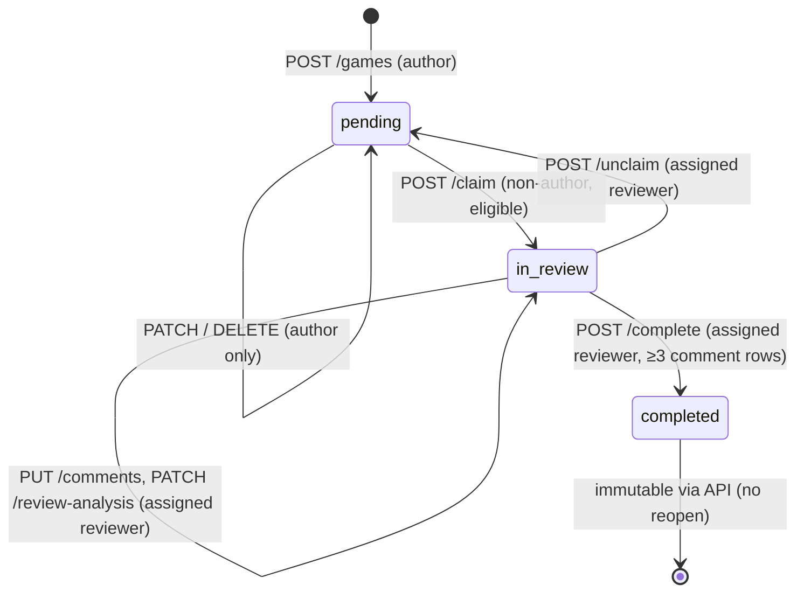

# Boardmates Redesign Integration Map

**Status:** Approved — revision 3 (2026-09-13).
- Product decisions D1–D14 are recorded in §17.
- The launch vertical slice and implementation order are in §14.
- Phase 0 progress is tracked in §14.4: task 0.1 is implemented (commit `20b8322`, not deployed) and task 0.2 is completed. No migrations or dependencies have been added.
- **Current priority: the recruiter-first UI release (§20).** Phase 0 task 0.3 and the dedicated Supabase test project are paused for the later AI/backend release.

**Scope:** How to integrate the approved Claude Design export into the working Boardmates monorepo without replacing the application that powers myboardmates.com. Delivery is **one AI-assisted production launch**.

> Naming note: the brief refers to `frontend/` and `backend/`. In this repository they are **`client/`** (React + Vite) and **`server/`** (Express + Prisma). All paths below use the real names.

## Revision history

| Rev | Date | Change |
| --- | --- | --- |
| 1 | 2026-09-12 | Initial draft: current-state inventory, export inventory, matrices, migrations, 14-phase order, tests, risks, open decisions |
| 2 | 2026-09-12 | **Approved.** See the list below |
| 3 | 2026-09-13 | Task 0.2 forensic findings and Phase 0 status. See the list below |
| 4 | 2026-09-27 | Recruiter-first UI release sequence (§20); task 0.3 paused. See the list below |
| 5 | 2026-09-29 | UI-2 delivered (§20.4). See the list below |

Revision 2 changes:

- Recorded decisions D1–D14 and clarifications K1–K13 with recommended defaults (§17).
- Replaced the 14-phase order with the launch vertical slice: Phase 0–7 plus a deferred list, a Phase 0 task breakdown, release policy and a cutover checklist (§14).
- Made the following launch requirements: Stockfish analysis, provider-neutral LLM drafts, the required summary, node-anchored notes, server-enforced publication gate v2, pre-publication visibility rules and a minimal review-ready notification.
- Limited signed-in navigation to Home, Submit Game, My Games and Profile, with the review queue on Home.
- Deferred Explore, Activity, Settings, reputation, connected accounts, advanced imports and post-publication editing.
- Added a target lifecycle and visibility model (§7.4) and a Launch column to §8.3, §9 and §11.
- Added approved deviations from the export (§18) and a reference-preservation plan (§19).

Revision 3 changes:

- Recorded task 0.2 as completed: historical cause unconfirmed; failure mode and mitigation documented (§14.7).
- Added Phase 0 task status (§14.4).
- Strengthened `useReliableMutation`: bounded timeout, visible recovery state, reconciliation before any retry, and no blind retry after an ambiguous timeout (§12, §15.4, R7).
- Added slow, dropped and completed-but-response-lost response cases to task 0.3 and Phase 6 QA (§14.2, §14.4, §15.1, §15.6).
- Corrected the `.gitignore` description: it does not currently ignore `redesign-reference/` (§1, R19, §19).

Revision 4 changes:

- Added the recruiter-first UI release sequence, its rules and UI-1 delivery notes (§20).
- Paused Phase 0 task 0.3 and the dedicated Supabase test project; tasks 0.4–0.7 defer with it (§14.4).
- Recorded that §14 stays the plan of record for the AI-assisted launch, with delivery re-ordered by §20 (§14).

Revision 5 changes:

- Marked UI-2 complete and recorded its commit (§20.1, §20.4).
- Added UI-2 delivery notes: shell, responsive navigation, Home dashboard, preserved contracts, export differences, checks and deferred work.

## Contents

1. [Sources inspected and ground rules](#1-sources-inspected-and-ground-rules)
2. [Key findings and approved launch shape](#2-key-findings-and-approved-launch-shape)
3. [Current routes and protected-route rules](#3-current-routes-and-protected-route-rules)
4. [Current API services and contracts](#4-current-api-services-and-contracts)
5. [Authentication and state management](#5-authentication-and-state-management)
6. [Chessboard, move tree, variation and annotation logic](#6-chessboard-move-tree-variation-and-annotation-logic)
7. [Submission, exclusive claim and completion lifecycle](#7-submission-exclusive-claim-and-completion-lifecycle) (current state, and the approved target in §7.4)
8. [Export inventory: screens, design tokens, reusable components](#8-export-inventory-screens-design-tokens-reusable-components)
9. [Mock fields in the export without backend support](#9-mock-fields-in-the-export-without-backend-support)
10. [Screen → route → API matrix](#10-screen--route--api-matrix)
11. [Existing vs new backend capability matrix](#11-existing-vs-new-backend-capability-matrix)
12. [Recommended frontend adapters](#12-recommended-frontend-adapters)
13. [Required additive database migrations](#13-required-additive-database-migrations)
14. [Launch vertical slice and implementation order](#14-launch-vertical-slice-and-implementation-order)
15. [Testing requirements](#15-testing-requirements)
16. [Risks](#16-risks)
17. [Decision record and clarifications](#17-decision-record-and-clarifications)
18. [Approved deviations from the export](#18-approved-deviations-from-the-export)
19. [Preserving the redesign reference](#19-preserving-the-redesign-reference)
20. [Recruiter-first UI release](#20-recruiter-first-ui-release)

---

## 1. Sources inspected and ground rules

| Area | Files read |
| --- | --- |
| Server | `server/src/server.js`, `src/routes/*`, `src/controllers/*`, `src/middleware/auth.js`, `src/utils/*`, `src/config/supabase.js`, `config/db.js`, `prisma/schema.prisma`, all 5 migrations, `API_ENDPOINTS.md`, `README.md`, `package.json` |
| Client | `src/App.jsx`, `main.jsx`, all `pages/*`, `components/*`, `context/*`, `hooks/*`, `utils/*`, `constants/*`, `services/api.js`, `lib/*`, `data/*`, CSS custom properties in `styles/layout.css`, `App.css`, `index.css`, `vercel.json`, `.env.example`, `package.json` |
| Export | `redesign-reference/Boardmates.dc.html` (all 16 screens, 2 modals, toast, the inline `data-dc-script` logic and mock data), `redesign-reference/support.js` (header and directive parsing only), `redesign-reference/uploads/Boardmates_Live_Site_Audit_2026-08-11.md` |
| Verified at runtime (read-only) | chess.js 1.4.0 `loadPgn` / `getHeaders` behaviour; chessboard.js 1.0.0 CSS class names; React Router 7.13.1 `useBlocker` requires a data router; Node v24.12.0; Prisma 6.19.3; jQuery 4.0.0; SHA-256 of every reference file (§19) |
| Production, read-only (2026-09-13, task 0.2) | Anonymous requests to `www.myboardmates.com` and its assets; `api.myboardmates.com` health, one CORS preflight, the first public feed page and completed-game details; public GitHub deployment records; DNS lookups. No sign-ins, dashboards or writes (§14.7) |

**Ground rules**

1. The export is a **visual and component reference**. It is a single Claude Design canvas: inline styles, `sc-if`/`sc-for` directives rendered by `support.js` (`dc-runtime`), a static CSS-grid board, and `setTimeout`-simulated mutations. None of it is shippable code, and `support.js` must never be bundled.
2. **Approved decisions (§17) override the export** wherever they conflict. §18 lists every approved deviation.
3. Existing routes, the chess.js + chessboard.js board, the move tree, exclusive claim, private games, comments, variations and completion must keep working in production until the Phase 7 cutover.
4. Before cutover, only Phase 0 server safety fixes change production behaviour. Every redesigned page ships behind flags that are off in production (§14.1).
5. **`redesign-reference/` is not committed.** `.gitignore` is managed by the user and is not changed by this plan. §19 recommends how to keep a versioned copy outside the client build.

Legend used in the matrices:

| Code | Meaning |
| --- | --- |
| **E** | Existing endpoint/field, usable as-is |
| **D** | Derivable in the client from existing responses (adapter only) |
| **A** | Additive, backward-compatible extension of an existing endpoint (new optional query param or response field). Still a contract change — needs review |
| **N** | New endpoint over existing tables (no migration) |
| **M** | New endpoint/field that needs an additive migration (§13) |
| **X** | New external subsystem (Stockfish worker, LLM provider, email, OAuth provider, Chess.com/Lichess import) |
| **B** | Behavioural change to an existing endpoint (same shape, different rules) |

Launch codes used in §8.3, §9 and §11:

| Code | Meaning |
| --- | --- |
| **Launch** | Required in the first redesigned production release |
| **Launch (derived)** | Shipped using client derivation only |
| **Copy** | Shipped with changed wording or behaviour per a decision (§18) |
| **Recommended** | Not strictly required, but strongly advised before launch |
| **Hidden** / **Deferred** | Not shown and not built for launch |
| **Removed** | Prototype-only or unsupported claim; never shipped |

---

## 2. Key findings and approved launch shape

### 2.1 Findings about the current system

1. **Frontend parity work needs no migration, but the approved launch does.**
   - Phases 1–2 (foundations, shell, auth, submission, Home, My Games, game detail) can run on the current schema.
   - The launch needs M02, M07, M04, M05 and M08, and M01 and M15 are recommended (§13).
2. **Existing defects must be fixed before the redesign exposes them.** All are confirmed in source and all are Phase 0 work:
   - **R1 — private-game leak in feed pagination.** `listGames` sets `where.OR` for privacy, then *overwrites* it when a `cursor` is present (`server/src/controllers/gameController.js:89-109`). Page 2+ of `GET /api/games` includes private, unreviewed games. D2 also requires private games to stay hidden after publication.
   - **R2 — claim is not atomic** (`gameController.js:294-336`). Concurrent claims can both succeed.
   - **R3 — unclaim keeps the previous reviewer's comments and tree** (`gameController.js:391-417`). Under D5 the endpoint must not be usable until the archive model exists.
   - **R4 — review content is public before publication.** `GET /api/games/:id` and `GET /api/games/:id/comments` need no auth and return in-review comments and `analysisTree`. This violates D4.
   - **R5 — comments are keyed by `(gameId, ply, san)`** rather than tree node, so variation notes can collide with main-line notes. Node anchors are required for launch.
3. **Frozen "Submitting… / Claiming… / Finishing…" states (audit): historical cause unconfirmed.** Task 0.2 (§14.7) found the deployed frontend byte-identical to the inspected client code and ruled out CORS, mixed content, redirects and current frontend-version drift. No inspected client path stays pending after a request settles. The confirmed weakness is that API requests have no timeout or post-timeout reconciliation, so a delayed or never-completing response leaves the UI loading indefinitely. `useReliableMutation` (§12) is the required mitigation.
4. **Rule conflicts between the export and the backend are now decided**, and each needs a server change:

   | Decision | Change | When it takes effect in production |
   | --- | --- | --- |
   | D1 | +300 using verified rapid rating (server has +200) | Config flip at cutover |
   | D2 | Private stays private after publication (server lists completed private games) | Phase 0 |
   | D3 | ≥3 meaningful notes + completed summary (server requires 3 comment rows) | Gate v2, enforced at cutover |

5. **`API_ENDPOINTS.md` is stale.** It omits `playerColor`, `gameResult`, `isPrivate`, `rapidRating` in profile responses, and `POST /api/auth/validate-chess-username`. §4 is the corrected contract.
6. **Dead code:** `context/GameContext.jsx`, `data/mockFeed.js`, `data/mockReviewedGame.js`. `api.js` exports `updateGame`, `deleteGame`, `unclaimReview`, `fetchComments`, `updateProfile` that no UI calls.
7. **There are no automated tests.** Node 24's built-in `node:test` covers adapters and server logic with zero new dependencies. Component and end-to-end tooling needs approval.
8. **`useBlocker` needs a data router.** React Router 7.13.1's `useBlocker` throws unless the app uses a data router, but the app renders `<BrowserRouter>`. D13's "flush pending saves before navigation" therefore needs either explicit flush-then-navigate handlers plus `beforeunload`/`pagehide`, or a migration to `createBrowserRouter`. This is decided in Phase 1 (§17.2 K14).
9. **Auto-provisioned profiles use the email local part as the display name** (`middleware/auth.js`, `displayNameFromAuthUser`). With D8 moving chess identity to post-signup onboarding, new users could appear publicly under their email prefix until onboarding completes (K7).

### 2.2 Approved launch shape

- **One production launch.** The redesigned frontend and the AI-assisted submit-to-publication lifecycle go live together at the Phase 7 cutover. Production keeps the legacy UI until then. Phase 0 server safety fixes ship immediately.
- **Lifecycle at launch** (§7.4):
  1. Submit (with structured focus areas).
  2. Stockfish analysis job identifies critical moments.
  3. A provider-neutral LLM produces structured explanation drafts.
  4. An eligible reviewer (**300 rating points higher**, verified rapid) claims exclusively.
  5. The reviewer accepts, edits, dismisses, replaces or ignores every draft, and can review fully manually when analysis fails.
  6. The server enforces **≥3 meaningful move-specific notes + completed summary**.
  7. Publication, then locked (D11).
  8. Human-approved learner review, with AI disclosure only when AI content was used, plus a minimal in-app review-ready notification.
- **Visibility:** before publication, notes, variations, summaries, analysis data and AI drafts are visible only to the assigned reviewer (D4). Private games are never listed, before or after publication (D2).
- **Signed-in navigation:** Home, Submit Game, My Games, Profile. The review queue is a section of Home.
- **Visual system:** dark-only, export tokens and fonts, accessible SVG icons, limited blur, self-hosted chess pieces (D7, D12).
- **Auth:** email + password, 8-character minimum; no "Keep me signed in"; chess identity collected in post-signup onboarding; Google hidden until configured and tested (D8).
- **Deferred:** dedicated Explore, full Activity, reputation, Settings, connected accounts, advanced imports (links / account import), post-publication editing and versions, release/unclaim UI, helpful feedback, saved games, account deletion, public platform stats, PGN export, AI summary drafts, arrows/circles (§14.3).
- **Root switch:** `/` becomes the signed-in Home dashboard and signed-out landing page only at Phase 7, after the complete AI-assisted lifecycle passes Phase 6 QA (D9).

---

## 3. Current routes and protected-route rules

Source: `client/src/App.jsx`. Router: React Router 7 `BrowserRouter`. Hosting rewrite: `client/vercel.json` sends every path to `/` (SPA).

Provider order: `BrowserRouter` → `ThemeProvider` → `AuthProvider` → `<Analytics/>` (Vercel) → `Routes`. `QueryClientProvider` wraps `App` in `main.jsx`.

| Route | Component | Inside `Layout` (sidebar + topbar) | Guard | Page title | Notes |
| --- | --- | --- | --- | --- | --- |
| `/` | `pages/Feed.jsx` | Yes | Public | `Boardmates \| Feed` | Infinite feed; guest banner; inline claim with confirm |
| `/submit` | `pages/SubmitGame.jsx` | Yes | Public preview | `Boardmates \| Submit Game` | Guests see the form; submit button replaced by auth prompts; `handleSubmit` redirects to `/login` with `state.from` if unauthenticated |
| `/game-detail/:id` | `pages/GameDetail.jsx` | Yes | Public | `Boardmates \| Reviewed Game` (for every status) | Claim from detail; sandbox moves on board; no client privacy check (private games are "link access") |
| `/profile` | `pages/Profile.jsx` | Yes | `RequireAuth` | `Boardmates \| Profile` | Own profile only; no public profile route |
| `/review-game/:id` | `pages/ReviewGame.jsx` | Yes | `RequireAuth` | `Boardmates \| Review Game` | **No client check that the viewer is the assigned reviewer, nor that status is `in_review`.** Any signed-in user sees the editor; writes fail server-side (403/409). Completed games still show the comment form |
| `/login` | `pages/Login.jsx` | No | `RedirectIfAuth` | `Boardmates \| Login` | Redirects to `location.state.from.pathname` or `/` after sign-in; "Remember me" checkbox is non-functional |
| `/signup` | `pages/signup.jsx` | No | `RedirectIfAuth` | `Boardmates \| Signup` | Requires chess platform + username; live username check on blur |
| `/forgot-password` | `pages/ForgotPassword.jsx` | No | Public | `Boardmates \| Forgot Password` | Supabase `resetPasswordForEmail` → `/reset-password` |
| `/reset-password` | `pages/ResetPassword.jsx` | No | Public (needs Supabase recovery session) | `Boardmates \| New Password` | Updates password, signs out, redirects to `/login` with `passwordResetSuccess` |
| `*` | `pages/PageNotFound.jsx` | No | Public | `Boardmates \| Page Not Found` | Footer still says "© 2024 · Chess MVP" |

**Guard behaviour**

- `RequireAuth`: while `auth.loading` renders a full-screen branded loader; when `!isAuthenticated` → `<Navigate to="/login" state={{ from: location }} replace />`. `isAuthenticated` is `!!session` — a **Supabase session is enough; a local profile row is not required** by the client guard.
- `RedirectIfAuth`: renders nothing while loading; if authenticated → `<Navigate to="/" replace />`.
- Server-side enforcement is authoritative: `requireAuth` (valid Supabase JWT, auto-provisions a `users` row except on `POST /auth/signup`) and `requireProfile` (403 if no row). Role/ownership rules live in controllers (§7).
- Layout: `Layout.jsx` holds `collapsed` (desktop sidebar) and `mobileOpen` (drawer, closed on route change). `Topbar` shows today's date, guest Log in / Sign up links, or two **non-functional** icon buttons (Notifications, Account) when signed in. `Sidebar` nav: Feed, Submit Game, Profile, Sign out / guest auth prompts.

**Client-side mutation navigation today**

| Action | Where | On success |
| --- | --- | --- |
| Submit game | `SubmitGame.jsx` | invalidate `["games"]`, `["profile"]` → `navigate("/")` (not to the created game) |
| Claim | `Feed.jsx` | `navigate("/review-game/:id", replace)` → invalidate `["games"]` |
| Claim | `GameDetail.jsx` | invalidate `["games"]`, `["game", id]` → `navigate("/review-game/:id", replace)` |
| Complete | `ReviewGame.jsx` | invalidate `["games"]`, `["game", id]`, `["profile"]` → `navigate("/")` (not to the published review) |
| Save comment | `ReviewGame.jsx` | `setQueryData(["game", id], response.game)`; **no error UI** |
| Draft tree autosave | `ReviewGame.jsx` | `setQueryData(["game", game.id], response)`; errors swallowed |

---

## 4. Current API services and contracts

Base URL: `VITE_API_URL` (client), default `http://localhost:5000/api` in `services/api.js` only — `AuthContext.jsx` uses `import.meta.env.VITE_API_URL` **without** that fallback.

**Transport (`client/src/services/api.js`)**: `request(path, options)` reads the Supabase session on every call (`supabase.auth.getSession()`), sends `Content-Type: application/json` and `Authorization: Bearer <access_token>` when present, throws `Error(body.message || "Request failed: <status>")` with `err.status` and `err.body` on non-2xx, returns `null` for 204.

**Server middleware (`server/src/server.js`)**: `cors()` (all origins), `helmet()`, optional global `express-rate-limit` (off unless `RATE_LIMIT_ENABLED`), `express.json()`, routes, JSON 404 `{ message: "Route not found" }`. No request-body size limit beyond Express defaults (100 kb JSON), which bounds the `analysisTree` payload size.

**Error shape**: `{ message: string, errors?: [{ field, message }] }`. Codes: 400 validation, 401 missing/invalid token, 403 forbidden/no profile, 404 not found, 409 state conflict, 500 server, 502 (chess username verification upstream failure).

### 4.1 Shared response shapes

`GameSummary` — produced by `formatGame()` in `gameController.js`:

```text
{
  id: uuid, authorId: uuid, title: string,
  status: "pending" | "in_review" | "completed",
  isPrivate: boolean, timeControl: string, averageRating: number | null,
  playerColor: "white" | "black" | null, gameResult: "win" | "lose" | "draw" | null,
  reviewNotes: string | null,
  submittedAt: ISO, claimedAt: ISO | null, completedAt: ISO | null,
  author: { id, displayName }, reviewer: { id, displayName } | null
}
```

`GameFull` = `GameSummary` + `pgn: string` + `comments: Comment[]` (ordered by ply) + `analysisTree?: TreeNodeJson` (key **omitted** when null).

`Comment` = `{ id, ply: int, san: string | null, comment: string, createdAt, updatedAt }`.

`TreeNodeJson` = `{ fen: string, san: string | null, ply: int, comment: string, children: TreeNodeJson[] }` (stored as minified JSON text in `games.analysis_tree`).

`User` — `formatUser()` in `authController.js`: `{ id, email, displayName, chessUsername, chessPlatform: "chess_com" | "lichess" | null, rapidRating: number | null, createdAt }`.

`Page<T>` = `{ games: T[], nextCursor: uuid | null, hasMore: boolean }`. Cursor = id of the last item; ordering `createdAt desc, id desc`; `limit` default 10, clamped 1–50.

### 4.2 Endpoints

| Method & path | Auth | Client caller | Request | Response | Rules / notes |
| --- | --- | --- | --- | --- | --- |
| `GET /` | — | — | — | `{ status, message, timestamp }` | Health |
| `POST /api/auth/validate-chess-username` | **None** | `signup.jsx` (blur), `AuthContext.signUp` (preflight) | `{ chessUsername \| chess_username, chessPlatform \| chess_platform }` | 200 `{ chessUsername (lower-cased), rapidRating }` | 400 invalid platform / <2 chars / not found upstream; 409 already linked; 502 upstream error. Calls Chess.com (`/pub/player/:u` + `/stats`) or Lichess (`/api/user/:u`). Unauthenticated → abuse vector if rate limit off |
| `POST /api/auth/signup` | `requireAuth` (no auto-provision on this path) | `AuthContext.signUp`, `hydrateProfileFromAuthMetadata` | same body | 201 new / 200 updated `User` | Verifies username upstream; sets `displayName = chessUsername`, stores `rapidRating` |
| `GET /api/profile` | `requireAuth` | `AuthContext.fetchProfile` (raw `fetch`, retries once on 429) | — | `User` | Refreshes `rapidRating` from upstream at most every 6 h **per process** (in-memory `Map`) |
| `PATCH /api/profile` | `requireAuth` | none | `{ displayName?, chessUsername?, chessPlatform? }` | `User` | ≥1 field; `chessUsername` re-verified upstream, also overwrites `displayName` and `rapidRating`; cannot clear chess identity (min 2 chars) |
| `GET /api/profile/stats` | auth + profile | `Profile.jsx` | — | `{ submitted, reviewed, inProgress }` | submitted = all authored (incl. private); reviewed = completed as reviewer; inProgress = in_review as reviewer |
| `GET /api/profile/games` | auth + profile | `Profile.jsx` | `?cursor&limit` | `Page<{ id, title, status, isPrivate, timeControl, averageRating, submittedAt, reviewer }>` | **No** status filter, `author`, `reviewNotes`, `completedAt`, `claimedAt` |
| `GET /api/profile/reviews` | auth + profile | `Profile.jsx` (twice: `completed`, `in_review`) | `?cursor&limit&status=in_review,completed` | `Page<{ id, title, status, timeControl, submittedAt, claimedAt, author }>` | Ordered by **submission** date, not claim/completion; unknown statuses silently ignored; **no** `completedAt`, `averageRating`, `isPrivate` |
| `GET /api/games` | None | `Feed.jsx` | `?cursor&limit&status=pending,in_review,completed` | `Page<GameSummary>` | Hides `isPrivate && status != completed` **on the first page only** (cursor bug). Unvalidated `status` or non-uuid `cursor` → Prisma error → 500 |
| `GET /api/games/:id` | None | `GameDetail.jsx`, `ReviewGame.jsx` | — | `GameFull` | No visibility rules: private and in-review drafts readable by anyone with the id |
| `POST /api/games` | auth + profile | `SubmitGame.jsx` | `{ pgn*, timeControl*, playerColor*, gameResult*, title?, averageRating?, reviewNotes?, isPrivate? }` | 201 `GameSummary` + `pgn` | PGN must load in chess.js with ≥1 move; `averageRating` optional server-side (required by client); title = custom → detected opening (≈50-entry prefix table) → `Game · <timeControl>`; `isPrivate` only when strictly `true` |
| `PATCH /api/games/:id` | auth + profile | none | `{ title?, reviewNotes?, timeControl?, averageRating?, playerColor?, gameResult? }` | `GameSummary` + `pgn` | Author only (403), `pending` only (409). **Cannot change `isPrivate` or `pgn`** |
| `DELETE /api/games/:id` | auth + profile | none | — | 204 | Author only, `pending` only |
| `POST /api/games/:id/claim` | auth + profile | `Feed.jsx`, `GameDetail.jsx` | — | `GameSummary` | See §7.2 |
| `POST /api/games/:id/unclaim` | auth + profile | none | — | `GameSummary` | Assigned reviewer, `in_review` → `pending`; comments/tree retained |
| `POST /api/games/:id/complete` | auth + profile | `ReviewGame.jsx` | `{ analysisTree? }` | `GameFull` | Assigned reviewer, `in_review`, ≥3 `review_comments` rows |
| `PATCH /api/games/:id/review-analysis` | auth + profile | `ReviewGame.jsx` (debounced) | `{ analysisTree }` (object or JSON string, must contain `fen`) | `GameFull` | Assigned reviewer, `in_review` |
| `GET /api/games/:id/comments` | None | none | — | `{ comments: Comment[] }` | Public |
| `PUT /api/games/:id/comments` | auth + profile | `ReviewGame.jsx` | `{ ply*, san?, comment, analysisTree? }` | Upsert: `Comment & { game: GameFull }`; empty comment: `{ deleted: true, ply, san, game: GameFull }` | Assigned reviewer, `in_review`; `ply` not type-checked (string → 500) |

### 4.3 Database (Prisma `server/prisma/schema.prisma`)

| Table | Columns | Constraints |
| --- | --- | --- |
| `users` | `id uuid` (= Supabase user id), `email` unique, `display_name`, `chess_username` unique nullable, `chess_platform ChessPlatform?`, `rapid_rating int?`, `created_at` | — |
| `games` | `id`, `author_id`, `reviewer_id?`, `title`, `pgn`, `status GameStatus` default `pending`, `is_private` default false, `time_control`, `player_color?`, `game_result?`, `average_rating?`, `review_notes?`, `analysis_tree text?`, `created_at`, `claimed_at?`, `completed_at?` | FK author **RESTRICT**, FK reviewer **SET NULL**; **no indexes** beyond PK |
| `review_comments` | `id`, `game_id`, `reviewer_id`, `ply`, `san?`, `comment`, `created_at`, `updated_at` | unique `(game_id, ply, san)` (NULL `san` rows are not unique in Postgres); FK game **CASCADE**, FK reviewer **RESTRICT** |

Enums: `GameStatus(pending, in_review, completed)`, `ChessPlatform(chess_com, lichess)`, `PlayerColor(white, black)`, `GameResult(win, lose, draw)`.

---

## 5. Authentication and state management

### 5.1 Authentication

| Concern | Implementation |
| --- | --- |
| Identity provider | Supabase Auth, email + password only. Client: `lib/supabase.js` (anon key, default localStorage session persistence, `detectSessionInUrl` default). Server: `src/config/supabase.js` (service-role key) |
| Token to API | `services/api.js` attaches `Authorization: Bearer <session.access_token>` per request; server verifies with `supabaseAdmin.auth.getUser(token)` on every request (network call per request) |
| Local profile | `users` row keyed by Supabase user id. Created by `POST /auth/signup`, or auto-provisioned by `requireAuth` on any other authenticated call (`ensureUserProfile`: display name from metadata/email, **no chess identity**, email-collision fallback `<id>@users.local`) |
| Signup (`AuthContext.signUp`) | 1) `POST /auth/validate-chess-username` (unauthenticated preflight) → 2) `supabase.auth.signUp` with `user_metadata { displayName, chessUsername, chessPlatform }` and `emailRedirectTo` → 3) if a session is returned immediately, `POST /auth/signup`. Distinguishes `needsConfirmation` and `repeatedSignup` (empty identities) |
| Email-confirmed signups | On the next session (`getSession` or `onAuthStateChange`), `hydrateProfileFromAuthMetadata` calls `POST /auth/signup` from metadata if the profile lacks chess identity |
| Sign in / out | `signInWithPassword`; `signOut` clears session + profile; sidebar navigates to `/login` |
| Password reset | `resetPasswordForEmail(redirectTo: /reset-password)` → recovery session → `updateUser({ password })` → sign out → `/login` |
| Password rule | Client: ≥6 chars (signup and reset). Server-side rule is whatever the Supabase project enforces |
| Redirect origin | `lib/authRedirect.js` uses `VITE_AUTH_EMAIL_REDIRECT_ORIGIN` or `window.location.origin` (must be allow-listed in Supabase) |
| OAuth | Not wired in the client. The server already tolerates OAuth users via auto-provisioning |
| Reviewer eligibility | Depends on `users.rapid_rating`, which only exists once a chess identity is verified |

`AuthContext` value: `{ session, user: profile, viewerId: profile?.id ?? session?.user?.id, loading, isAuthenticated: !!session, signUp, signIn, requestPasswordReset, updatePassword, signOut, refreshProfile }`. `loading` becomes false only after the initial profile fetch and metadata hydration finish. `INITIAL_SESSION` events are ignored to avoid a double fetch.

### 5.2 State management

| Layer | Mechanism | Details |
| --- | --- | --- |
| Server state | TanStack Query v5 (`main.jsx`) | Defaults: `staleTime` 60 s, query `retry` 1, mutations no retry. Devtools mounted in all builds |
| Query keys | | `["games"]` (infinite feed, no filters in key), `["game", id]` (detail and review; `ReviewGame` sets `staleTime` 5 min and `refetchOnWindowFocus: false`), `["profile", "stats"]`, `["profile", "games"]`, `["profile", "reviews", "completed"]`, `["profile", "reviews", "in_review"]` |
| Invalidation gaps | | Claim does not invalidate `["profile", …]` (in-progress count stale for up to 60 s); comment saves don't touch the feed or profile |
| Auth state | React context (`context/AuthContext.jsx`, `auth-context.js`, `useAuth.js`) | Profile is **not** in React Query; `refreshProfile()` refetches manually |
| Theme | `context/ThemeContext.jsx` | `data-theme` on `<html>`, localStorage `boardmates-theme`, default `dark`; the light/dark toggle UI is commented out in `Profile.jsx`, so light mode is unreachable but its tokens still exist in `layout.css` |
| Move sounds | `utils/moveSound.js` | localStorage `boardmates.moveSoundEnabled`; synced across tabs via `storage` event in `ChessBoard` |
| Page/UI state | `useState` per page | Feed: `claimingId`, `confirmingId`, `claimError`. Submit: all form fields. Detail: `currentNode`, `sandboxFen`, claim confirm. Layout: `collapsed` (not persisted), `mobileOpen` |
| Board/review state | `hooks/useAnalysisTree.js` | Mutable node graph held in refs plus version counters (§6) |
| Unused | `context/GameContext.jsx` + `data/mockFeed.js`; `data/mockReviewedGame.js` | Never mounted or imported by routes. Safe to leave untouched |

---

## 6. Chessboard, move tree, variation and annotation logic

### 6.1 Board rendering — `components/ChessBoard.jsx`

- Engine/rules: **chess.js 1.4.0**. Renderer: **@chrisoakman/chessboardjs 1.0.0**, which needs a global jQuery. **jQuery 4.0.0** is dynamically imported and assigned to `window.$`. chessboard.js was built against jQuery 1–3, so any new board features on this stack carry a compatibility risk.
- Piece images are **hot-linked** from `https://chessboardjs.com/img/chesspieces/wikipedia/{piece}.png`.
- Props: `fen`, `currentNode`, `onMove(from, to, promotion?) → node | {fen} | null`, `onFirst/onPrev/onNext/onLast`, `moveLabel`, `readOnly` (never passed as `true` by current pages).
- Interaction: drag-and-drop plus click-to-move. The first click selects an own piece; the second click on a square calls `onMove`, including empty squares via a `pointerdown` listener. Illegal drops snap back. Drops are disabled when `isGameOver()`.
- Highlights: last-move `from`/`to` recomputed by replaying `node.san` from `node.parent.fen` and adding `.square-highlight` (`game-review.css:336`). The selected square uses the same class.
- Flip: local `isFlipped` state. It is also a dependency of the init effect, so **flipping destroys and re-creates the board**.
- Controls: first, previous, move label, next, last, flip, sound toggle (accessible labels present).
- Coordinates: chessboard.js default notation is shown; `showNotation` is not configured. Square colours come from chessboard.js defaults `.white-1e1d7 #f0d9b5` / `.black-3c85d #b58863`, which is where the export's walnut/slate/olive themes would be applied.
- Promotion: always queen (`promotion = "q"` in `useAnalysisTree.makeMove` and `GameDetail.handleBoardMove`). There is no under-promotion UI.
- Keyboard: `hooks/useKeyboardNav.js` (global `keydown`, ignored in inputs): ← previous, → next (main child), ↑ first, ↓ last.

### 6.2 Tree model

Runtime node: `{ id, fen, san, ply, comment, parent, children[] }`.

- `children[0]` is the continuation shown as the main line from that node.
- `children[1..]` are variations.
- The root has `ply` 0 and `san` null.

`getMoveLabel(node)` produces `Start`, `12. Nf3` or `12... Nb4`.

Serialized (API) node: `{ fen, san, ply, comment, children }`. `serializeAnalysisTreeNode` **drops every other key**, so a future `shapes`, `eval` or `nodeId` on a node would be erased by the current client's next save.

There are three builders with different id schemes. Counters are module-level and reset per build.

| Builder | Used by | Precedence |
| --- | --- | --- |
| `useAnalysisTree` → `buildTreeFromAnalysisJson` (`at-N`) + `applyCommentsToTree`, else `buildTreeFromPgnWithComments` (`pgn-N`), else empty root (numeric ids) | `ReviewGame.jsx` | JSON tree wins; review_comment rows then **overwrite** node comments by `(ply, san)` BFS first match |
| `buildTreeFromAnalysisJson` or a local `buildTreeFromPgn` (`detail-N`, a duplicate of `buildTreeFromPgnWithComments`) | `GameDetail.jsx` | JSON tree wins; comments rows are **not** overlaid (only used when there is no tree) |
| `buildMockReviewedGame` (`mock-N`) | nothing | — |

PGN import (verified): `chess.loadPgn()` parses RAV variations, `{comments}` and headers, but `history()` returns **main line only**. Submitters' own variations and comments are discarded when trees are built. `getHeaders()` returns `White`, `Black`, `WhiteElo`, `BlackElo`, `Result`, `ECO`, `TimeControl`, `Date`, `Termination` and `Site` from Chess.com-style exports. Parse errors are raw grammar messages such as `Expected NAG, brace comment, … but "9" found.`

### 6.3 Variations

- **Reviewer (`/review-game/:id`)**: playing a legal move on the board at any node calls `makeMove`. If a child with the same SAN exists the tree navigates to it; otherwise a new child is appended, which becomes a variation if the node already had children. `structureVersion` increments.
- **Draft autosave**: `structureVersion` change → 1.1 s debounce → `PATCH /games/:id/review-analysis` with the serialized full tree (the previous request is aborted) → response written with `setQueryData(["game", id])`.
- **Rebuild on server data**: any change to `analysisTree`, comments or pgn in the cached game changes `serverSig`, and `useLayoutEffect` **rebuilds the whole tree**. Position is preserved by first node with an equal FEN; transpositions can jump to another branch.
- **Consequence**: `CommentForm` resets its textarea whenever `currentNode` changes identity (`useEffect([currentNode])`). Typing a note shortly after creating a variation is wiped when the autosave response rebuilds the tree.
- **Visitor (`/game-detail/:id`)**: board moves create an ephemeral `sandboxFen` (label "Analysis board"). It is not added to the tree and is discarded on any navigation.
- **Rendering (`components/MoveList.jsx`)**: two-column numbered rows; variations render recursively as `.variation-block` directly under the move they branch from. Active move gets `.active-move`, commented moves get `.has-comment` (dotted underline). Move cells are `<span onClick>`, which are not keyboard-focusable.
- **Missing today**: delete variation, promote variation, collapse, explicit "add line" control, PGN export.

### 6.4 Annotations

- One free-text comment per node. The editor is `components/CommentForm.jsx` ("Annotate 12... Nb4", Clear, Save). **Clear saves an empty comment, which deletes the row.**
- Save path (`ReviewGame.handleSaveComment`):
  1. Mutates `node.comment` locally.
  2. Sends `PUT /games/:id/comments { ply, san, comment, analysisTree: fullTree }`.
  3. The server upserts the `(game, ply, san)` row and persists the tree.
  4. The response `game` replaces the cache, which triggers a tree rebuild.
- Failure path: the local tree keeps the comment but no row exists and no error is shown. At completion the tree (with the comment) is saved while the minimum-comment count uses rows. **Two sources of truth** can diverge.
- Reading: `components/CommentList.jsx` collects all nodes with comments (main line and variations), sorts by ply, supports substring search on label and text, and click-to-navigate. Items are `<div onClick>`, which are not keyboard-operable. The empty-state copy tells read-only visitors to "Select a move and add a comment".
- Counting: `constants/review.js` `MIN_REVIEW_COMMENTS = 3`, `countSavedReviewComments(game.comments)` — rows, not tree nodes.
- No categories, authorship, arrows/circles, evaluation or summary exist.

---

## 7. Submission, exclusive claim and completion lifecycle



### 7.1 Submission

1. **Client validation** (`SubmitGame.jsx`): PGN present (upload tab reads a `.pgn` via `FileReader`; paste tab textarea), result, colour, time-control category, average rating is a positive integer, and `validatePlayablePgn` (chess.js, ≥1 move — duplicated in `client/src/utils` and `server/src/utils`).
2. **Time control is lossy**: the select offers categories and maps them to fixed strings — `bullet→"1+0"`, `blitz→"3+2"`, `rapid→"15+10"`, `classical→"30m"`, `daily→"1d"`. **Stored `time_control` values are not the real clock** for any game submitted through the current UI.
3. `POST /api/games`. The server re-validates, resolves the title and creates `status = pending`, `author_id = viewer`.
4. On success the client invalidates the feed and profile and navigates to `/`. The new game id is ignored.
5. Visibility: public games appear in the feed immediately. Private games are hidden until `completed` but remain fetchable and claimable by id ("share the link").
6. Author may edit metadata or delete while `pending` (API only; no UI).

### 7.2 Exclusive claim

Server rules (`claimGame`), evaluated in order:

| Check | Failure |
| --- | --- |
| Game exists | 404 |
| Viewer is not the author | 403 "You cannot review your own game" |
| `status === pending` | 409 "Game is already being reviewed" |
| Public game only: viewer `rapidRating > 0` | 403 "Add your rapid rating to review games." |
| Public game only: game `averageRating > 0` | 409 "missing an average rating" |
| Public game only: `rapidRating ≥ averageRating + 200` | 403 "You need a rapid rating of at least N" |
| Private game | Any authenticated non-author may claim; gap skipped |

Then `update { status: in_review, reviewerId, claimedAt: now }`.

- **Atomicity**: the status check and the update are separate queries without a conditional `WHERE status = 'pending'`, so concurrent claims are not mutually exclusive (§16 R2).
- **Client mirrors** the rating rule in two places with slightly different copy (`Feed.getReviewEligibility`, `GameDetail`). Feed does not apply the private exemption, which is harmless only because private games never appear in the feed while pending.
- **Card CTAs** (`GameCard.jsx`):

  | Viewer | Pending | In review | Completed |
  | --- | --- | --- | --- |
  | Guest | Lock icon | "View (Locked)" | "View Review →" |
  | Author | "View Game →" | "View (Locked)" | "View Review →" |
  | Eligible reviewer | "Review Game →" + inline confirm | — | "View Review →" |
  | Ineligible reviewer | Disabled button with reason | — | "View Review →" |
  | Assigned reviewer | — | "Continue Review →" | "View Review →" |

- **Unclaim** (`unclaimGame`): assigned reviewer only, `in_review → pending`, clears `reviewerId`/`claimedAt`. It does **not** delete that reviewer's `review_comments` or `analysis_tree`. No UI calls it.

### 7.3 Completion

1. The reviewer UI shows "n/3 comments saved" and disables Complete Review until `countSavedReviewComments ≥ 3`, then shows an inline "Mark as completed?" confirm.
2. `POST /complete { analysisTree: serialized full tree }`. The server checks status `in_review` (409), assigned reviewer (403) and `count(review_comments) ≥ 3` (400), then sets `completed`, `completedAt` and optionally the tree.
3. Client invalidates queries and navigates to `/`.
4. After completion: `PUT /comments` and `PATCH /review-analysis` return 409, but `/review-game/:id` still renders the editor (audit §4.10). There is no reopen, versioning or notification.
5. **Legacy data**: completed games with **zero** comments exist in production (audit §7.1). They predate the 3-comment rule (`38a4bd8`, 2026-05-16). Older games may also have `average_rating`, `player_color`, `game_result` or `analysis_tree` as NULL (columns added 2026-05-02 and later).

### 7.4 Approved target lifecycle for launch

```mermaid
stateDiagram-v2
    [*] --> pending: POST /games (author, chess profile complete)
    state pending {
        [*] --> queued
        queued --> analyzing: worker leases job
        analyzing --> drafting: critical moments found
        analyzing --> failed: engine error or timeout
        drafting --> ready: drafts valid
        drafting --> partial: engine ok, drafts failed
        failed --> queued: bounded retry
    }
    pending --> in_review: POST /claim (atomic; non-author; public game needs verified rapid ≥ avg + 300; analysis terminal, timed out or absent)
    in_review --> in_review: autosave notes, variations, summary; accept / edit / dismiss / replace / ignore drafts (assigned reviewer only)
    in_review --> completed: POST /complete (gate v2)
    completed --> [*]: locked (D11); submitter gets in-app review-ready notification
```

Release (`in_review → pending`) is **not available at launch** (D5). The API rejects it while `REVIEW_RELEASE_ENABLED=false`, and no UI exposes it.

**Visibility model (D2, D4, D10)**

| Content | Before publication: assigned reviewer | Before publication: submitter | Before publication: anyone else | After publication: anyone who can open the game |
| --- | --- | --- | --- | --- |
| PGN moves, parsed metadata, submitter question, focus areas | Yes | Yes | Yes (private: link only) | Yes (private: link only, never listed) |
| Lifecycle status: pending / analysis status / being reviewed by *reviewer name* | Yes | Yes | Yes | Yes |
| Critical-moment list or count, engine evaluations | Yes | No | No | No (K4, K5) |
| AI drafts in any state | Yes | No | No | **Never** |
| Human notes, structured note fields, variations (analysis tree) | Yes | No | No | Published notes and variations |
| Review summary | Yes | No | No | Yes |
| AI disclosure | Per-note authorship in workspace | No | No | Only if a published note or the summary has AI authorship |

Enforcement is server-side in `formatGame` and every endpoint that returns review content. Clients must not rely on hiding.

**Publication gate v2 (D3; K1, K2)** — implemented in `POST /complete`, selected by `REVIEW_PUBLICATION_GATE=v2`:

1. `status = in_review` and the caller is the assigned reviewer, checked in the same conditional update (`WHERE status = 'in_review' AND reviewer_id = :me`).
2. **At least 3 meaningful move-specific notes** belonging to the current claim. A meaningful note:
   - is anchored to a move node (`ply ≥ 1`, `node_path` present, or a legacy `(ply, san)` row that matches exactly one tree node);
   - has trimmed text of at least `MIN_MEANINGFUL_NOTE_CHARS` (default proposed in K1);
   - counts once per node.
   Accepted or edited AI drafts count, because acceptance is an explicit reviewer action (K1).
3. **Completed summary:** overall assessment, what went well, main improvement and next practice action are non-empty. Recurring theme is optional (K2).
4. Drafts not accepted, edited, dismissed or replaced become `ignored` and are never published.
5. In one transaction: set `completed` / `completedAt`, close the claim attempt (if M15), and insert the `review_published` notification for the author.
6. Idempotent retry: the same reviewer calling again after success receives 200 with the published game (supports `useReliableMutation`).
7. Error responses list each unmet requirement in `errors[]` so the publish dialog can show exact gaps.

**Analysis rules (D10; K3, K11, K13)**

- A job is enqueued when a game is created (after M07). Games pending at cutover get backfill jobs (K11).
- Terminal analysis states are `ready`, `partial` and `failed`. A game with no job (legacy) is treated like `failed`: manual review.
- Games appear in the Home review queue and are claimable only when analysis is terminal, absent, or has exceeded `ANALYSIS_TIMEOUT` (K3).
- Retries: automatic and bounded with backoff. The owner may retry while the game is unclaimed. After a claim the reviewer proceeds manually (K13).
- LLM output is validated against a versioned JSON schema. Invalid or failed drafts leave the moment without a draft (`partial`), never with unvalidated text.

---

## 8. Export inventory: screens, design tokens, reusable components

### 8.1 Screens and overlays in `Boardmates.dc.html`

| # | `data-screen-label` | Template line | Prototype state key | What it shows |
| --- | --- | --- | --- | --- |
| 1 | Public home | 85 | `landing` | Marketing header, hero with review card, 3-step pipeline, recently reviewed, engine-vs-reviewer comparison, footer with legal/community links |
| 2 | Authentication | 233 | `auth` | Testimonial panel; Sign in / Create account tabs; Google button; keep-signed-in; password rules; inline error; optional onboarding preview |
| 3 | Home dashboard | 328 | `dashboard` | Search, notifications badge, "review is ready" banner, 4 stat tiles, games needing a reviewer, your games, recently reviewed |
| 4 | Explore review queue | 440 | `explore` | Needs review / Recently reviewed tabs, sort and filters, eligibility explainer, queue cards with gap, load more, empty state with alert |
| 5 | Submit game | 506 | `submit` (steps 1–4) | Stepper: import options (link, account, file, paste) with progress and errors → confirm parsed metadata with final-position board → focus chips, question, title, visibility → summary and submit |
| 6 | Analysis progress | 672 | `processing` | Pipeline step list, waiting-for-reviewer callout, notification note, analysis failure state |
| 7 | Game detail | 725 | `game` (+ `role`) | Prototype role switcher (owner / eligible / ineligible / signed-out); header status and role CTA; eligibility tiles; submitter question; board and controls; role-specific notes panel with moment preview |
| 8 | Reviewer workspace | 854 | `workspace` | Full-height 3-column layout: board with eval bar and tools; compact move list with critical-moment dots and a variation; Moments / Saved notes / Summary tabs; AI draft panel; note editor; tone guidance; save state; progress; focus mode; Complete review |
| 9 | Publish success | 1051 | `published` | Confirmation, counts, contribution points, next actions, lock/versioning note |
| 10 | Completed review | 1071 | `review` | Share / Export PGN, reviewer card with badges and AI disclosure, takeaway summary (4 tiles), sticky board, moment chips, lesson cards (notice/better/habit, engine evidence), helpful prompt, legacy fallback |
| 11 | Notifications | 1232 | `notifs` | Activity list with unread dots and CTAs, delivery preferences |
| 12 | Profile | 1268 | `profile` | Verified reviewer, multi-rating chips, 5 stats, reputation badges and specialties, recent contribution, tabs (Reviews given / Submitted / In progress / Saved) |
| 13 | My games | 1339 | `mygames` | Status filter chips (All, Analyzing, Waiting, In review, Completed, Private), search, rows |
| 14 | Settings | 1373 | `settings` | Connected accounts (Chess.com + Lichess), board theme swatches, coordinates / eval bar / reduce motion, privacy default, danger zone |
| 15 | Mobile screens | 1418 | `mobile` | 390×844 mocks: home with bottom nav, workspace with bottom sheet, completed review, submit step 1 |
| 16 | Foundations | 1597 | `foundations` | Semantic colours, type scale, 20 pipeline statuses, 4 authorship states, button variants |
| — | Claim modal | 1672 | `modal: claim` | Claim details table, question, conflict state copy |
| — | Publish modal | 1698 | `modal: publish` | Checklist (notes, drafts resolved, summary, no save errors), learner preview, lock note |
| — | Toast | 1722 | `toast` | `role="status"`, auto-dismiss 5.2 s, kinds ok / err / info |
| — | Screen palette | 1735 | `palette` | **Prototype navigation only — do not ship** |

Sidebar (lines 29–80, shown on signed-in screens and hidden in workspace focus mode): brand, 6 nav items (Home, Explore Reviews, Submit Game, My Games, Review Activity with badge, Profile), "Reviewer standing" card, user footer with rating and settings.

Inline logic (`data-dc-script`, lines 1754–2093): `MOVES` (53 plies, from→to only, no chess rules), `GLYPH`, `MOMENTS` (4), `FEED` (9), `NOTIFS` (5), `STATUS` (10 display statuses), `THEMES` (3 boards), a `DCLogic` component with simulated `save / accept / dismiss / claim / publish / submitGame`, and props `boardTheme`, `showEvalBar`, `showCoordinates`.

### 8.2 Design tokens (extracted)

**Colour — surfaces and lines**

| Token (proposed name) | Value | Used for |
| --- | --- | --- |
| `--bm-page` | `#08111F` | Page background |
| `--bm-surface-sunken` | `#0B1524` | Sidebar, headers, footer, input wells |
| `--bm-surface` | `#0F1A2B` | Cards and panels |
| `--bm-surface-elevated` | `#152238` | Nested cards, chips, hover on secondary buttons |
| `--bm-surface-selected` | `#1C2B44` | Selected tab/card, control hover |
| `--bm-surface-hover` | `#16233A` / `#12203A` | Nav hover / card hover |
| `--bm-line-subtle` | `#1B2942` | Dividers |
| `--bm-line` | `#26364F` | Card and input borders |
| `--bm-line-strong` | `#33456B` | Hover borders |
| `--bm-line-overlay` | `#2E4160` | Modal, toast, palette borders |
| `--bm-overlay` | `rgba(4,9,17,.72)` | Modal scrim |
| `--bm-header-glass` | `rgba(8,17,31,.86–.9)` + `backdrop-filter: blur(10px)` | Sticky headers (the audit brief discouraged glassmorphism — keep it subtle or drop it) |

**Colour — text**

| Token | Value |
| --- | --- |
| `--bm-text` | `#F4F7FB` |
| `--bm-text-body` | `#D5DEEA` (lesson body `#E4EAF2`) |
| `--bm-text-secondary` | `#A5B2C5` |
| `--bm-text-muted` | `#7E8CA2` |

**Colour — semantic.** Every tint is the base colour at 13–14 % alpha, and borders at 26–40 %.

| Role | Base | Hover | On-colour | Surface |
| --- | --- | --- | --- | --- |
| Action / info / in review | `#69A7FF` | `#8DBEFF` | `#08111F` | `rgba(105,167,255,.13)` |
| AI assist | `#55C5D8` | `#7BD8E7` | `#06222A` | `#0D2028` |
| Human approved / success / publish | `#32C48D` | `#4BD8A2` | `#062018` | `#12281F` (hover `#143024`) |
| Waiting / warning / critical moment | `#F2B84B` | — | — | `#1F1A0E` |
| Error / destructive | `#F06D7A` | — | — | `rgba(240,109,122,.08)` |
| Neutral (draft, private) | `#A5B2C5` on `rgba(126,140,162,.14)` | — | — | — |

Focus ring: `outline: 2px solid #69A7FF; outline-offset: 2px`. Text selection: `rgba(105,167,255,.3)`.

**Board**

| Token | Value |
| --- | --- |
| Walnut (default) | light `#E8D6B6`, dark `#A97B5B` |
| Slate | `#D6DCE4` / `#7C8AA0` |
| Olive | `#E4E3C7` / `#93A06B` |
| Last-move highlight | `rgba(242,184,75,.34)` |
| Coordinates | on light `rgba(60,42,26,.62)`, on dark `rgba(255,248,236,.66)`, 2.1cqw / 600 |
| Eval bar | track `#1A2231`, white share `#EFE9DC`, 12 px wide |

The export draws pieces as Unicode glyphs. Keep the current chessboard.js piece images, or self-host images; glyph rendering varies by OS font.

**Typography** (Google Fonts). Current app loads DM Sans 400/500/600 and DM Serif Display via `@import` in `App.css` and `layout.css`.

| Role | Family / size / weight | Notes |
| --- | --- | --- |
| UI | DM Sans 400/500/700 | Add weight 700 |
| Marketing display | Source Serif 4, 38–56 / 600, tracking −1 to −1.4 px | New family (replaces DM Serif Display) |
| Takeaway / quote | Source Serif 4, 21–29 / 400–600 | |
| Page title | DM Sans 25 / 700, −0.5 px (dashboard 26, detail 24–27) | |
| Section title | 17 / 700 | |
| Card title | 14.5 / 600 (14–15.5) | |
| Body | 13.5 / line-height 1.6–1.65 | |
| Moves, ratings, clocks, counts | IBM Plex Mono 400/500/600, `font-variant-numeric: tabular-nums` | New family |
| Meta / helper | 11.5 / `#7E8CA2` | |
| Overline | 10.5–11 / 600–700, uppercase, 0.05–0.1 em | |

**Shape, spacing and motion**

- **Radius:** 4 (focus) · 5 (move cell) · 7–8 (chips, small buttons) · 9–10 (buttons, inputs) · 11–13 (cards) · 14–16 (panels, modals) · 20 (pills) · 50 % (avatars) · 42 (mobile frame, mock only).
- **Layout:** sidebar 244 px; page header 62 px (workspace 58 px); page padding 26 px 30 px; max widths 1180 (public), 1300 (dashboard/explore), 1320–1360 (detail/review), 1100–1120 (profile/my games), 960 (submit), 820 (notifications), 760 (settings), 660 (form column).
- **Grids:** `repeat(auto-fit, minmax(180–340px, 1fr))`. Workspace: `minmax(280px,1.1fr) minmax(150px,190px) minmax(320px,.95fr)`.
- **Hit targets:** 36–48 px min height (mobile 46).
- **Motion:** `bm-rise` (0.18–0.2 s entrance), `bm-pulse` (saving), `bm-sweep` (1.4 s indeterminate progress); all disabled under `prefers-reduced-motion`.
- **Shadows:** cards none; hero `0 28px 70px rgba(0,0,0,.45)`; modal `0 30px 70px rgba(0,0,0,.6)`; toast `0 18px 40px rgba(0,0,0,.45)`.
- **Scrollbar:** `.bm-scroll` thin thumb `#26364F`.

**Relationship to current tokens (D7, D12).**
- Redesigned UI adopts the export tokens and fonts above and is **dark-only**.
- While legacy pages remain in production, map the legacy dark variables in `styles/layout.css` (`--color-background-primary`, `--color-text-*`, `--color-brand`, `--color-*-soft-*`) to the new tokens only inside the redesign flag, so legacy production pages are unchanged.
- Light-mode values are not maintained for redesigned components and the hidden theme toggle is not reintroduced.
- Fonts: DM Sans 400/500/700, Source Serif 4 400/600, IBM Plex Mono 400/500/600, loaded with `display=swap` and only these weights. The woff2 files may be self-hosted as static assets; no package is needed.

**Contrast to verify.** `#7E8CA2` on `#0F1A2B` ≈ 5.1:1 (pass). On `#152238` ≈ 4.7:1 (marginal pass). **On `#1C2B44` ≈ 4.2:1 (fails AA for small text; used for inactive stepper numbers)** — adjust the muted colour on selected surfaces.

**Icons (D12).**
- Inline SVG only.
- Decorative icons get `aria-hidden="true"`.
- Icon-only buttons get an `aria-label` and a visible focus ring.
- Never use Unicode symbols as icons (the export's ☼, ⚙, ◎, ◆ and similar are replaced).

**Blur (D12).** Default to opaque headers (`#0B1524`). If blur is used at all, limit it to the sticky page header, with an opaque fallback. No blur on modals, cards, mobile bottom sheets or scroll containers.

**Chess pieces (D12).**
- Self-host a piece set under `client/public/pieces/` and point chessboard.js `pieceTheme` at it. There must be no runtime requests to `chessboardjs.com`.
- Confirm the licence of the chosen set before committing. The current Wikipedia set originates from Wikimedia Commons.
- Launch board colours are walnut only (`#E8D6B6` / `#A97B5B`), applied by overriding `.white-1e1d7` / `.black-3c85d` inside the board wrapper.
- Slate and olive are deferred with Settings.

### 8.3 Reusable components to build (React, no new dependencies)

| Component | Export source | Replaces / wraps today | Launch |
| --- | --- | --- | --- |
| `AppShell`, `SidebarNav` (Home, Submit Game, My Games, Profile; collapse kept), `UserFooter` (no settings gear) | lines 29–80 | `Layout`, `Sidebar` | Launch |
| `ReviewerStandingCard` | 61–69 | — | Removed (reputation deferred) |
| `PageHeader` (title, primary CTA; no search or bell) | 329–338 | `Topbar` | Launch |
| `PublicHeader` (Sign in, Create account), `PublicFooter` | 86–103, 216–229 | none | Launch — released at Phase 7; footer links per K8 |
| `MobileBottomNav` (Home, Submit centre action, My Games, Profile), `BottomSheet` with tabs | 1451–1457, 1487–1505 | mobile drawer | Launch |
| `StatusPill` (lifecycle + analysis statuses, locked, claim conflict, retry) | `STATUS`, 1626–1647 | `STATUS_CONFIG` badges | Launch |
| `Button` variants: primary, secondary, tertiary, publish, destructive, disabled-with-reason, loading | 1659–1667 | `.primary-btn`, `.review-btn`, `.complete-review-btn` | Launch |
| `SegmentedTabs`, `FilterChips` | 259–262, 1347–1349 | — | Launch |
| `SelectFilter` (sort / time control / rating) | 454–456 | — | Deferred (Explore) |
| `StatTile` | 355–372, 1288–1294 | `.stat-item` | Launch (existing stats only) |
| `GameQueueCard` (Home queue), `GameCompactRow`, `RecentReviewCard` | 381–433, 465–489, 1354–1366 | `GameCard`, profile cards | Launch — no critical-moment counts (D4) |
| `Callout`, `EmptyState`, `LegacyReviewNotice` | 459–462, 496–500, 560–567, 1222–1225 | `.feed-empty`, `.submit-error`, `.auth-error` | Launch |
| `Stepper`, `ImportOptionCard` (upload + paste only), `IndeterminateProgress`, `PipelineStepList` | 511–557, 685–695 | tabs in `SubmitGame` | Launch |
| `PgnPreviewSummary` (metadata grid + final-position mini board) | 577–604 | none | Launch |
| `VisibilityFieldset` | 630–640 | privacy checkbox | Copy (§18) |
| `FocusAreaChips` | 617–625 | none | Launch from Phase 3, hidden until focus-area storage (D14) |
| `ChessProfileOnboarding` (platform, username, verified rating) | 311–318 (preview only) | chess fields in `signup.jsx` | Launch |
| `BoardPanel` = existing `ChessBoard` + `EvalBar` (assigned reviewer only) + `BoardControls` + `BoardTools` (flip, coordinates, sound) + caption | 787–807, 875–912 | `ChessBoard` (engine kept) | Launch |
| Arrow / circle drawing tools | 907–909, 990 | — | Deferred |
| `MoveListCompact` (mono rows, **recursive variations**, critical-moment markers for assigned reviewer) | 914–936 | `MoveList` | Launch |
| `MomentCard`, `AiDraftPanel` (Accept, Edit, Dismiss, Replace; untouched = ignored) | 949–982 | none | Launch (workspace only) |
| `NoteEditor` (structured fields, learner rating context, save state), `ToneGuidance`, `SaveStateIndicator`, `PublishProgress` (notes n/3 + summary) | 862–868, 984–998 | `CommentForm`, "n/3 comments saved" | Launch |
| `NotesList` with search, edit, delete | 1003–1021 | `CommentList` | Launch |
| `SummaryForm` (5 fields; 4 required per K2) | 1032–1042 | none | Launch |
| AI summary draft ("Use as starting point") | 1026–1031 | — | Deferred (K12) |
| `ReviewerCard` (name, rating, Verified chess profile; no badges) | 1087–1100 | `.reviewer-badge` | Launch |
| `TakeawayPanel`, `LessonCard` (no engine evidence), `MomentChips`, `AiDisclosure` | 1103–1211 | `CommentList` items | Launch |
| `HelpfulPrompt` | 1213–1220 | none | Deferred |
| `ReviewReadyBanner` | 346–353 | none | Launch (minimal notification) |
| `NotificationItem`, `PreferenceToggleList` | 1240–1262 | none | Deferred (Activity, Settings) |
| `ConnectedAccountRow`, `BoardThemeSwatch`, `DangerZone` | 1376–1413 | none | Deferred (Settings) |
| `Dialog` (focus trap, `aria-modal`), `ClaimDialog`, `PublishDialog` | 1672–1717 | inline confirm buttons | Launch (copy per §18) |
| `Toast` region + `useToast` | 1722–1733 | none | Launch |

Never ship: the Game detail role switcher (726–733), the screen palette, the `DCLogic` component and `support.js`.

---

## 9. Mock fields in the export without backend support

Only fields **not** fully served by an existing endpoint are listed. Fields that are fully served today are omitted: title, status pending / in_review / completed, time control string, average rating, submitter and reviewer display names, `reviewNotes` question, submitted date, private flag, PGN moves, move comments, variations, stats submitted / reviewed / in-progress, member since, rapid rating and chess platform.

- **Support** uses the §1 legend.
- **Launch treatment** uses the launch codes, with the capability (`C..`, §11), migration (`M..`, §13) or decision (`D..` / `K..`, §17).
- **Rule:** anything not marked Launch, Launch (derived) or Copy is hidden. Mock numbers are never shipped.

### 9.1 Global shell and sidebar

| Field as mocked | Export source | Support | Launch treatment |
| --- | --- | --- | --- |
| Reviewer standing: "340 contribution points", progress bar, "3 more reviews to Endgame Specialist" | sidebar 61–69 | None | Removed (reputation deferred, C35) |
| Nav items Explore Reviews and Review Activity; nav badge "2"; header bell "2 unread" | `navItems`, 336 | None | Removed — nav is Home, Submit Game, My Games, Profile |
| Settings gear and destination | `goSettings` | Partial (`PATCH /profile`) | Removed (Settings deferred) |
| Header search "Search games, openings, players" | 332–335 | None | Hidden (C13 search deferred) |

### 9.2 Public home (released at Phase 7)

| Field | Source | Support | Launch treatment |
| --- | --- | --- | --- |
| "212 reviews published … this month", "1,480 games reviewed", "36 h median" | 109, 118, 252 | None (SQL-derivable) | Removed (C38 deferred) |
| "+300 min. reviewer rating gap" | 119 | Server +200 today | Copy — "Reviewers are 300 rating points higher" (D1) |
| "100% human-approved before publish" | 120 | Enforced by gate v2 + D10 | Copy — only after gate v2 is live |
| Hero players and ratings | 126 | D from PGN headers on detail | Launch — from persisted metadata (M02) for a real, public, published game only |
| Moment category chip, "✓ Human approved" | 141, 143 | None | Launch — structured fields and authorship (M04) |
| Reviewer "1778 rapid · 34 reviews" | 148 | None (reviewer select is `{ id, displayName }`) | Rating: Recommended (C39); review count: Hidden |
| Recently reviewed "N moments" | `recent[].moments` | None in lists | Copy — "N notes" (C14, optional) or hidden |
| How it works, Reviewer standards, Help, Rules, Privacy, Terms, Security links | 94–98, 223–225 | None | Per K8 — real pages or omitted; never dead links |

### 9.3 Authentication and onboarding

| Field | Source | Support | Launch treatment |
| --- | --- | --- | --- |
| "Continue with Google" | 268, 297 | Server auto-provisions OAuth users | Hidden until provider and redirects are configured and tested (D8) |
| "Keep me signed in for 30 days" | 282–284 | None | Removed; Supabase persistent session (D8) |
| Password rules "10+ characters, a number or symbol" | 305–307 | Client ≥6 | Copy — "At least 8 characters" for signup and reset; Supabase minimum set to 8 (D8) |
| Signup without chess identity | 296 | Server allows; client requires chess fields | Launch — email + password only, then onboarding (D8, K7) |
| Onboarding: connect platform, confirm rating | 313–314 | E (one platform, rapid) via `POST /auth/validate-chess-username` + `PATCH /profile` | Launch |
| Onboarding: learning goals, "submit, review, or both" | 315–316 | None | Removed (C06 deferred) |
| Testimonial and its stats | 242–253 | Marketing content | Removed unless a real quote is approved |

### 9.4 Home dashboard (signed-in `/`, released at Phase 7)

| Field | Source | Support | Launch treatment |
| --- | --- | --- | --- |
| "Two games match your rating range today" | 343 | None server-side | Launch — count from the eligible queue query (C13 subset) |
| "Your human review is ready" banner | 346–353 | None | Launch — minimal notification (C31 subset, M08) |
| "…published 4 move-specific notes and a summary" | 350 | Note count none; summary none | Launch — from published review payload |
| Stat "Reviews received" | 361–362 | None (derivable) | Recommended (C36, A) |
| Stat "Contribution points" | 369–370 | None | Removed |
| "You are eligible for games rated below 1478" | 376 | D | Copy — "You can review games rated up to 1478 (300 rating points below your verified rating)" (D1) |
| Queue card "◆ N critical moments detected" | 394–396 | None | Removed; show analysis status only (D4, K4) |
| Your games statuses Analyzing / AI draft ready / Analysis failed | `STATUS` | None | Launch (C30, M07) |
| Recently reviewed "Takeaway: …" | 431 | None | Launch — published summary overall assessment (M05); public games only (D2) |

### 9.5 Explore review queue (screen deferred; queue lives on Home)

| Field | Source | Support | Launch treatment |
| --- | --- | --- | --- |
| Needs review excludes own and ineligible games | `queue` | None | Launch on Home — `eligible=me`, `excludeMine=true`, analysis terminal (C13 subset, A) |
| Sort, time-control filter, "eligible for me only" select | 454–456 | None | Deferred |
| "at least 300 points below your rapid rating" | 461 | Server +200 | Copy per D1 wording |
| "N critical moments" chip | 479–481 | None | Removed (D4) |
| "Gap +N in your favour" | 486 | D | Launch (derived) |
| "Load 12 more" | 493 | E | Launch on Home as "Show more" (cursor) |
| "Notify me when a game matches" | 499 | None | Deferred (C33) |

### 9.6 Submit game (4 steps)

| Field | Source | Support | Launch treatment |
| --- | --- | --- | --- |
| Paste a Chess.com / Lichess game link; import from account | 528–537 | None | Hidden (advanced imports deferred, C09) |
| "Reading … 53 half-moves found" | 550–557 | D for paste/upload | Launch (derived) |
| "The move list stops at 18. Nc4" | 561–562 | Partial (chess.js grammar error only) | Launch (derived) — `pgnMetadata` locates the last legal move |
| "You have already submitted this game" | 564–567 | None | Deferred (C10) |
| Parsed players, ratings, result, exact clock + category, opening + ECO, moves, date | 591–598 | D from `getHeaders()`; not persisted | Launch — persisted in Phase 3 (C08, M02) because the LLM needs them |
| "Source Chess.com link" | 598 | None | Copy — "Uploaded file" / "Pasted PGN" (M02 `source`) |
| "reviewers rated 1369 and above can claim this game" | 601 | D | Copy per D1 |
| Focus chips | 617–625 | None | Hidden until M02; Launch from Phase 3 (D14). Never prepended to `reviewNotes` |
| Private: "share link … one reviewer … stays private after publication unless you choose to make it public" | 638 | Server lists completed private games | Copy — private stays private (D2, Phase 0); no "make public" action (deferred); link semantics per K6 |
| "Stockfish runs first, AI drafts…" and progress page | 651, 664 | None | Launch (Phase 3–4) |
| "we notify you when a reviewer claims … and when published" | 664 | None | Copy — publication notification only (minimal, M08) |

### 9.7 Analysis progress (owner view on game detail)

| Field | Source | Support | Launch treatment |
| --- | --- | --- | --- |
| Pipeline steps (imported → analyzing → moments detected → AI drafting → ready) | `procSteps` | None | Launch — job status (C30, M07) |
| "Depth 22", "4 critical positions found / ready with AI drafts" | 691, 703 | None | Copy — status wording only, no counts or engine details (D4, K4) |
| "Reviewers rated 1369+ … can see your game" | 703 | D | Copy per D1 |
| "Median wait at this rating is 36 hours" | 703 | None | Removed (C38 deferred) |
| "We will notify you twice" | 713–714 | None | Copy — "We'll let you know on Home when your review is published" |
| "Analysis timed out · Retry analysis · send to a reviewer without AI drafts" | 717–718 | None | Launch — owner retry while unclaimed; failed games remain claimable for manual review (D10, K13) |

### 9.8 Game detail (role variants)

| Field | Source | Support | Launch treatment |
| --- | --- | --- | --- |
| "akwasi001 (1084) played Black and lost to Aviv1969 (1053) · 27 moves" | 739 | D from PGN headers | Launch (derived; persisted after M02) |
| Eligible tiles: "Rating gap", "Minimum to publish 3 notes + summary" | 772, 774 | Gap D; summary gate none | Launch — copy per D1 / D3 |
| "Critical moments 4 with AI drafts", "Typical effort 18–25 minutes" | 773, 775 | None | Removed (D4; no data) |
| Ineligible: "Requires 1369+ rapid", "300 points stronger for the same time control" | 748–749, 844 | D; per-TC ratings none | Copy — "Requires a verified rating 300 rating points higher (1369+)"; never mention time control (D1) |
| Owner "Edit my question" | 754 | E (`PATCH`, pending only) | Recommended — until claimed |
| Owner "Copy share link" | 755 | D | Launch (derived) |
| Owner "Your game is analysed and waiting · 4 critical positions" | 765–768 | None | Copy — status only (D4) |
| Pre-claim "Preview of what Stockfish found" | 827–840 | None | Removed (D4 — analysis data is assigned-reviewer only) |
| Owner copy "AI drafts stay hidden until a reviewer has checked them" | 824 | Requires server enforcement | Copy — "Draft review content is visible only to your reviewer until it is published" (D4) |

### 9.9 Reviewer workspace

| Field | Source | Support | Launch treatment |
| --- | --- | --- | --- |
| Header "akwasi001 1084 · gap +709" | 859 | D (PGN) | Launch (M02 metadata) |
| Save state "Saved just now / Saving… / Unsaved changes" | 862–864, 992 | None for text | Launch — debounced autosave with Saving, Saved, Error (D13) |
| "2 of 4 moments done" + bar | 866–867 | None | Copy — "n of 3 notes · summary complete / incomplete" (D3) |
| Eval bar; "Engine evaluation after … +5.4" | 877–881, 911 | None | Launch — assigned reviewer only (C28, M07) |
| Coordinates toggle | 905 | D (`showNotation`) | Launch (derived) |
| Arrow / Circle / Clear; "Add arrow" | 907–909, 990 | None | Deferred (C27) |
| Critical-moment dot in move list | 921, 925 | None | Launch (reviewer only) |
| Moments tab: label, category, eval before → after, why, status badge | 949–960 | None | Launch (C28–C29, M07) |
| Source label AI draft / Edited by reviewer / Human approved / Dismissed | 964, `dstate` | None | Launch — adds Accepted and Ignored states (D10, M04/M07) |
| AI draft text and engine evidence | 968–973 | None | Launch (reviewer only) |
| Accept as my draft / Edit / Dismiss / Replace with mine | 975–978 | None | Launch; ignoring = no action (D10) |
| "writing for a 1084 player", tone guidance | 985, 994–997 | D | Launch (derived from submitter rating) |
| Saved notes authorship badge | 1014 | None | Launch (M04) |
| Summary tab AI draft, "Use as starting point" | 1026–1031 | None | Deferred (K12) |
| Summary fields and "Save summary" | 1032–1042 | None | Launch (C26, M05); autosaved (D13) |
| Publish checklist "Every AI draft accepted, edited, or dismissed" | 1705 | None | Copy — informational "N unused drafts will not be published" (D10) |
| "Summary completed", "No unresolved save errors", "Preview as the learner sees it" | 1706–1709 | None / D | Launch — server gate v2 + client flush |
| "After publishing, the review locks. Reopen with Edit published review … version stamp" | 1714, 1065 | Lock E; reopen none | Copy — "Published reviews can't be edited" (D11) |

### 9.10 Claim modal and publish success

| Field | Source | Support | Launch treatment |
| --- | --- | --- | --- |
| "Submitter akwasi001 · 1084 rapid" | 1679 | D (PGN) | Launch (M02 metadata) |
| "Minimum to publish 3 notes + a summary" | 1683 | None | Launch — D3 copy |
| Conflict "nadia_pf claimed this game 30 seconds ago" | 1692 | D (refetch gives reviewer + `claimedAt`) | Launch (derived) |
| "Here are 3 similar games in your range" | 1692 | None | Copy — "See other games on Home" |
| "akwasi001 has been notified" | 1055 | None | Launch — minimal in-app notification (M08) |
| "Your 4 notes and summary are now public" | 1055 | None | Copy — "published" (private games are not public, D2) |
| "+10 contribution points", "2 to next badge" | 1058–1059 | None | Removed |

### 9.11 Completed review (learner view)

| Field | Source | Support | Launch treatment |
| --- | --- | --- | --- |
| Share | 1076 | D | Launch (copy link) |
| Export PGN | 1077 | D (custom serializer) | Deferred |
| Reviewer card "1778 rapid · 35 reviews published" | 1092 | None | Rating Recommended (C39); count Hidden |
| Badges | 1096–1097 | None | Removed; show "Verified chess profile" when applicable (D6) |
| "AI-assisted analysis, reviewed and approved by …" | 1099 | None | Launch — only when AI content was used (D10) |
| Takeaway panel (overall + 4 tiles) | 1103–1124 | None | Launch (M05) |
| Lesson category, What to notice / Better plan / Habit | 1187, 1192–1205 | None | Launch — when present (M04) |
| "✓ Human approved" per lesson | 1189 | None | Launch — every published note is reviewer-approved |
| "Engine evidence behind this note" | 1206–1209 | None | Removed (K5) |
| "Was this review helpful?" | 1213–1220 | None | Deferred (C34) |
| Legacy fallback copy | 1222–1225 | D | Launch (derived); drop the "request a fresh review" action |

### 9.12 Notifications, profile, my games, settings

| Field | Source | Support | Launch treatment |
| --- | --- | --- | --- |
| Notifications screen, "Mark all as read", delivery preferences | 1232–1264 | None | Deferred (only the Home banner ships) |
| "Verified reviewer" badge | 1276 | None | Copy — "Verified chess profile": verified chess identity + rating; not a quality endorsement (D6) |
| "reviews games rated up to 1478" | 1278 | D | Copy per D1 |
| Blitz and classical ratings; "Helpful rate 94%" | 1281–1282, 1293 | None | Removed |
| Stat "Reviews received" | 1290 | None | Recommended (C36) |
| Reputation, specialties, recent contribution | 1298–1312 | None | Removed |
| Profile tab "Saved"; "Edit profile" | 1320, 1285 | None | Removed; "Update chess profile" opens onboarding |
| Row "N notes" | 1328 | None | Hidden unless C14 ships |
| My games filters All / Analyzing / Waiting / In review / Completed / Private | 1347–1349 | None on `/profile/games` | Launch — server filters (C37 subset, A) |
| My games search | 1351 | None | Deferred |
| Settings screen (accounts, themes, preferences, privacy default, delete account) | 1373–1413 | None | Deferred |

### 9.13 Status vocabulary at launch

| Export status | Backend source at launch | Visible to |
| --- | --- | --- |
| Draft, Importing, Parsing PGN, Invalid PGN, Preview ready, Submitting, Submission confirmed | Client-only pre-creation states | Submitter |
| Analysis queued, Stockfish analyzing, AI drafting, AI draft ready, Analysis failed, Retry required | `games.analysis_status` (M07) | Everyone — status only (D4) |
| Waiting for reviewer | `pending` + analysis terminal or absent | Everyone |
| Being reviewed / Locked to a reviewer | `in_review` | Everyone |
| Publishing | Pending mutation | Assigned reviewer |
| Human reviewed | `completed` (+ ≥1 note; otherwise legacy fallback) | Everyone who can open the game |
| Private | `isPrivate` flag (not a status) | Owner, assigned reviewer, anyone with the link |
| Claim conflict | 409 on claim | Claiming user |

---

## 10. Screen → route → API matrix

Existing routes keep their paths. Redesigned pages render only when the redesign flag is on (§14.1). Production flips at Phase 7.

| Export screen | Target route | Guard | APIs used | Adapters (§12) | Launch gaps → capability | Phase |
| --- | --- | --- | --- | --- | --- | --- |
| Foundations, toast, dialogs | global | — | — | `tokens.css`, `useReliableMutation`, `apiErrors` | — | 1 |
| 404, forgot / reset password | `*`, `/forgot-password`, `/reset-password` | Public | Supabase | `apiErrors` | 8-character minimum (D8) | 1 |
| Authentication — sign in | `/login` | `RedirectIfAuth` | Supabase `signInWithPassword`; `GET /profile` | `apiErrors` | No keep-signed-in; Google hidden (D8) | 1 |
| Authentication — create account | `/signup` | `RedirectIfAuth` | Supabase `signUp`; profile auto-provisioned on first authenticated call | `apiErrors` | Auto-provisioned display name must not use the email prefix (K7) | 1 |
| Onboarding (chess profile) | `/onboarding` (**new**) | `RequireAuth` | `POST /auth/validate-chess-username`, `PATCH /profile` | `onboardingState` | Required before Submit and Claim (K7) | 1 |
| App shell (signed in) | `Layout` | — | `GET /profile` | `navModel`, `featureFlags` | Nav: Home, Submit Game, My Games, Profile | 1 |
| Public header / footer | `/` signed-out variant | Public | — | `navModel` | Footer links per K8 | 1 (build), 7 (release) |
| Home dashboard | `/` signed-in variant | Public route, signed-in view | `GET /profile/stats`, `GET /profile/games`, `GET /games?status=pending`, `GET /games?status=completed` | `gameCard`, `viewerRole`, `gameStatus`, `profileStats` | Eligible queue filter (C13 subset) Phase 2; analysis status Phase 3; takeaways Phase 5; review-ready banner Phase 5 | 2 → 5 (release 7) |
| Review queue section + claim dialog | on Home and game detail | Auth for claim | `POST /games/:id/claim`, `GET /games/:id` on 409 | `viewerRole`, `useReliableMutation` | Atomic claim + gap config (Phase 0); claimability (K3, Phase 3) | 2 |
| Public landing | `/` signed-out variant | Public | `GET /games?status=completed&limit=3` (public only after D2) | `gameCard` | No platform stats (C38 deferred) | 2 (release 7) |
| Submit game | `/submit` | Public preview; submit requires auth and chess profile | `POST /games` (+ `focusAreas`, metadata from Phase 3) | `pgnMetadata`, `submitPayload`, `useReliableMutation` | Chips hidden until M02 (D14); navigate to created game | 2 → 3 |
| Analysis progress | `/game-detail/:id` owner status panel | Owner | `GET /games/:id` (+ `analysisStatus`), `POST /games/:id/analysis/retry` | `analysisStatus` | C30, M07 | 3 |
| Game detail — pending / in review | `/game-detail/:id` | Public; private by link | `GET /games/:id` (D4 status-only view), `PATCH /games/:id` (owner question) | `viewerRole`, `gameStatus`, `pgnMetadata`, `reviewTree` | D4 enforced in Phase 0 | 2 → 3 |
| Reviewer workspace | `/review-game/:id` | `RequireAuth` + assigned reviewer + `in_review`, else redirect to detail | `GET /games/:id` (reviewer view), `GET /games/:id/analysis`, `PUT /games/:id/comments` (node-anchored, structured, authorship), `PATCH /games/:id/review-analysis`, `POST /games/:id/moments/:momentId/decision`, `GET`/`PUT /games/:id/summary`, `POST /games/:id/complete` (gate v2) | `reviewTree`, `useReviewTree`, `momentDrafts`, `reviewSummary`, `saveState`, `publishChecklist`, `useReliableMutation` | C20, C24–C26, C28–C29, gate v2; no Release (D5) | 4 |
| Publish dialog | on `/review-game/:id` | Assigned reviewer | `POST /complete` | `publishChecklist` | Flush pending saves first (D13) | 4 |
| Publish success | `/game-detail/:id` with `state.justPublished` | Assigned reviewer | `GET /games/:id` | — | Minimal notification copy (M08) | 5 |
| Completed review (learner) | `/game-detail/:id` when `completed` | Public; private by link | `GET /games/:id` (published payload: notes, structured fields, variations, summary, `aiAssisted`) | `reviewNotes`, `aiDisclosure`, `reviewTree`, `pgnMetadata` | C24–C26, C39 (recommended) | 5 |
| Review-ready notification | Home banner | Submitter | `GET /notifications?type=review_published&unread=true`, `POST /notifications/:id/read` | `reviewReadyBanner` | C31 subset, M08 | 5 |
| My games | `/my-games` (**new**) | `RequireAuth` | `GET /profile/games` (+ `status`, `visibility`, `analysisStatus`) | `gameCard`, `gameStatus` | Filters C37 subset (A) Phase 2; analysis filter Phase 3 | 2 → 3 |
| Profile | `/profile` | `RequireAuth` | `GET /profile`, `/profile/stats`, `/profile/games`, `/profile/reviews?status=` | `gameCard`, `profileStats` | Verified chess profile derived (D6) | 2 |
| Mobile screens | responsive variants of the routes above | — | same as desktop | same | Bottom nav with 4 destinations | each phase; QA 6 |
| Root switch | `/` | — | — | `featureFlags` | After Phase 6 QA (D9) | 7 |
| Explore, Notifications (Activity), Settings, legal/standards pages | `/explore`, `/activity`, `/settings`, static pages | — | — | — | Deferred (§14.3); legal pages per K8 | — |

---

## 11. Existing vs new backend capability matrix

| ID | Capability | Status today | Current implementation | Proposed addition | Contract impact | Launch | Phase |
| --- | --- | --- | --- | --- | --- | --- | --- |
| C01 | Email/password auth | **Existing** | Supabase + `requireAuth` | 8-char minimum in Supabase and clients (D8) | None | Launch | 1 |
| C02 | Google sign-in | Missing (server ready) | `ensureUserProfile` | Provider + redirect allow-list; `signInWithOAuth` | X config | Hidden until tested (D8) | — |
| C03 | Password reset | **Existing** | Supabase | 8-char minimum | None | Launch | 1 |
| C04 | Chess identity verification + rapid rating | **Existing** (one platform) | `authController` | Used by onboarding | None | Launch | 1 |
| C05 | Multiple chess accounts, blitz/classical, sync time, disconnect | Missing | — | `chess-accounts` endpoints | A + M10 | Deferred | — |
| C06 | Onboarding goals / intent | Missing | — | Profile fields | A + M10 | Deferred | — |
| C07 | Submit PGN (paste / upload) | **Existing** | `POST /games` | — | None | Launch | 2 |
| C08 | Persisted PGN metadata (players, ratings, ECO, opening, date, exact clock, category, source, ply count) | Missing | Title-only opening detection | Server fills from headers; exposed in `GameSummary` | A + M02 | Launch (LLM context) | 3 |
| C09 | Import by link / from account | Missing | — | Import endpoints | N + X | Deferred | — |
| C10 | Duplicate submission detection | Missing | — | `pgn_hash` lookup | A + M02 | Deferred (hash column ships with M02) | — |
| C11 | Structured focus areas | Missing | — | `focusAreas: string[]` on create / detail | A + M02 | Launch (D14) | 3 |
| C12 | Public list + cursor, private excluded always | **Existing with R1 leak**; lists completed private games | `listGames` | Fix `OR` overwrite; `isPrivate = false` always (D2) | B | Launch | 0 |
| C13 | Queue filters | Missing | — | Launch subset: `eligible=me`, `excludeMine=true`, analysis terminal/absent/timed out. Deferred: search, sort, time-control filter | A | Launch (subset) | 2–3 |
| C14 | Note counts in list items | Missing | — | `noteCount` (published only) | A | Optional | — |
| C15 | Game detail with PGN, comments, tree | **Existing** (no visibility rules) | `getGame` | Role-aware serialization (C49) | B | Launch | 0 |
| C16 | Author edit/delete while pending; visibility change | **Existing** (no UI); visibility not editable | `updateGame`, `deleteGame` | "Make public" owner action later (D2) | A | Edit question: Recommended; visibility: Deferred | 2 |
| C17 | Private games semantics | **Existing** (unlisted, link access) | feed filter | Never listed before or after publication (D2); link access per K6 | B | Launch | 0 |
| C18 | Exclusive claim with rating requirement | **Existing** (race R2; +200) | `claimGame` | Conditional update; `REVIEW_RATING_GAP` config (300 at cutover, D1); analysis claimability (K3) | B | Launch | 0, 3, 7 |
| C19 | Release (unclaim) | **Existing** (no UI; R3) | `unclaimGame` | Disabled by `REVIEW_RELEASE_ENABLED=false`; archive model later (D5) | B | Deferred; endpoint disabled | 0 |
| C20 | Move notes upsert/delete with node anchor | **Existing** keyed by `(ply, san)` | `upsertComment` | Optional `nodePath`, `fen`; server resolves legacy rows | A + M04 | Launch | 4 |
| C21 | Variation tree autosave | **Existing** | `saveReviewAnalysisDraft` | Tolerant serializer; reviewer-only reads | None | Launch | 4 |
| C22 | Publication gate | **Existing** v1 (≥3 comment rows) | `completeReview` | Gate v2: ≥3 meaningful notes + completed summary; itemised errors; idempotent success; transactional notification (D3) | B | Launch — enforced at cutover | 4, 7 |
| C23 | Post-publication edit, reopen, versions | Missing (API locks) | — | Revisions table | N + M06 | Deferred (D11) | — |
| C24 | Structured note fields (category, what to notice, better plan, habit) | Missing | — | Optional fields on `PUT /comments` and `Comment` | A + M04 | Launch | 4 |
| C25 | Authorship (`human_written`, `ai_accepted`, `ai_edited`) and `aiAssisted` flag on published review | Missing | — | Server-set from draft decisions | A + M04 | Launch (D10) | 4–5 |
| C26 | Review summary | Missing | — | `GET`/`PUT /games/:id/summary`; `summary` in published `GameFull` | N + A + M05 | Launch (D3) | 4–5 |
| C27 | Board annotations (arrows, circles) | Missing | — | Optional `shapes` on tree nodes | A | Deferred | — |
| C28 | Stockfish analysis (per-ply evaluation, critical moments) | Missing | — | Worker; `GET /games/:id/analysis` (assigned reviewer only) | N + X + M07 | Launch (D10) | 3 |
| C29 | LLM structured drafts + reviewer decisions | Missing | — | Provider-neutral `ExplanationProvider`; `POST /games/:id/moments/:momentId/decision { action: accept \| edit \| dismiss \| replace }` | N + X + M07 | Launch (D10) | 4 |
| C30 | Analysis job status, retry, failure → manual path | Missing | — | `analysisStatus` in game payloads; `POST /games/:id/analysis/retry` (owner, unclaimed) | A + N + M07 | Launch | 3 |
| C31 | Notifications | Missing | — | Launch subset: `review_published` in-app only; `GET /notifications`, `POST /notifications/:id/read`. Full Activity deferred | N + M08 | Launch (minimal) | 5 |
| C32 | Email notifications + preferences | Missing | — | Provider | X + M09 | Deferred | — |
| C33 | Matching-game alerts | Missing | — | — | N + M08/M09 | Deferred | — |
| C34 | Helpful feedback | Missing | — | — | N + M11 | Deferred | — |
| C35 | Contribution points, badges, specialties | Missing | — | — | N + M12 | Deferred | — |
| C36 | Stats: reviews received | Partial | `getStats` | Extra key | A | Recommended | 2 |
| C37 | Own game list filters (`status`, `visibility`, `analysisStatus`) and `completedAt` | Partial | `getUserGames`, `getUserReviews` | Query params + fields | A | Launch (subset); search deferred | 2–3 |
| C38 | Public platform stats | Missing | — | `GET /api/stats/public` | N | Deferred | — |
| C39 | Rating + "Verified chess profile" on author/reviewer objects | Missing | `AUTHOR_SELECT = { id, displayName }` | `rapidRating`, `hasVerifiedChessProfile` | A | Recommended | 5 |
| C40 | Saved games | Missing | — | — | N + M13 | Deferred | — |
| C41 | User preferences sync | Missing | localStorage (sound) | — | N + M09 | Deferred | — |
| C42 | Account deletion | Missing | FK RESTRICT | — | N + M14 | Deferred | — |
| C43 | Claim attempts (audit; archive-ready scoping for notes, summary, decisions) | Missing | `claimedAt` / `completedAt` only | `review_attempts` written by claim / complete | M15 (no contract change) | Recommended | 4 |
| C44 | Legal / help / standards content, AI data-processing disclosure | Missing | Dead `<a>` tags | Static pages per K8 | None | Launch requirement per K8 | 6 |
| C45 | Share link | Implicit | Game URL | — | D | Launch | 2 |
| C46 | PGN export with notes and variations | Missing | — | Client serializer | D | Deferred | — |
| C47 | Claim conflict details | Partial | 409 message | Refetch game | D | Launch | 2 |
| C48 | Rate limiting on external-call and job endpoints | Existing (off by default) | global `express-rate-limit` | Per-route limits: username validation, analysis retry, drafting | None | Recommended | 0–3 |
| C49 | Pre-publication visibility (D4) | Missing | Public `GET /games/:id`, `GET /games/:id/comments` | Role-aware `formatGame`; non-reviewers get status only until `completed` | B | Launch | 0 |
| C50 | Server meta / capabilities | Missing | — | `GET /api/meta` → `{ reviewRatingGap, publicationGate, minMeaningfulNotes, capabilities }` so clients never hard-code rules that flip at cutover | N | Recommended | 1 |
| C51 | Provider-neutral LLM service | Missing | — | `ExplanationProvider` interface; provider adapters over HTTP (no SDK required); env-selected provider/model; schema validation; prompt versioning; usage metrics; timeouts; budget caps | X | Launch | 4 |
| C52 | Job worker | Missing | — | Separate process; Postgres-backed queue (`FOR UPDATE SKIP LOCKED` leases); Stockfish binary; timeouts; bounded retries; health metrics | X | Launch | 3 |
| C53 | Self-hosted chess-piece assets | Missing | Hot-linked images | `client/public/pieces/` + `pieceTheme` | None | Launch (D12) | 1 |

---

## 12. Recommended frontend adapters

Adapters are plain ES modules and hooks with no new dependencies. Proposed home:
- `client/src/adapters/` for pure functions, unit-testable with `node:test`;
- `client/src/hooks/` for React bindings.

Redesigned components consume **view models** from adapters, never raw payloads.

| Adapter | Signature (proposed) | Responsibility | Replaces / consolidates | Phase |
| --- | --- | --- | --- | --- |
| `serverMeta` | `useServerMeta() → { reviewRatingGap, publicationGate, minMeaningfulNotes, capabilities }` | Reads `GET /api/meta` (C50); falls back to safe defaults. Avoids hard-coding 200 / 300 or gate v1 / v2 in the client across the cutover | constants in `Feed.jsx`, `GameDetail.jsx`, `constants/review.js` | 1 |
| `featureFlags` | `isEnabled('redesign')` | Build-time `VITE_FEATURE_REDESIGN`; per-route legacy/redesign resolver. Local override allowed only in non-production builds until cutover | none | 1 |
| `navModel` | `getNavItems(auth)` | Signed-in: Home, Submit Game, My Games, Profile. Signed-out: Sign in, Create account. Mobile bottom nav: same four, Submit as centre action | `Sidebar` links | 1 |
| `onboardingState` | `getOnboardingState(profile) → { needsChessProfile, canSubmit, canClaim }` | Chess profile required before Submit and Claim (K7). Skip remembered locally for browsing only | chess fields in signup | 1 |
| `apiErrors` | `toUserError(err) → { title, message, fieldErrors, unmetRequirements, retryable }` | Normalises `{ message, errors[] }`, gate v2 unmet-requirement lists, Supabase auth errors | scattered `err.body?.errors?.[0]` reads | 1 |
| `useReliableMutation` | `useReliableMutation({ mutationFn, timeoutMs, reconcile, onSuccessNavigate })` | Required mitigation for the task 0.2 failure mode (§14.7). **Bounded timeout** on every mutation request. **Visible recovery state** while a request is slow or unresolved, never an indefinite loading label. After a timeout, network failure or 409, **reconcile server state before offering any retry**: claim — reviewer is me → success, another reviewer → conflict dialog, still pending → retry allowed; complete — completed by me → success, still in review → retry allowed; note save — refetch notes and compare; submit — needs a dependable way to find an already-created game (an idempotency key is recommended; an additive API change to decide before Phase 2). **Never retry automatically after an ambiguous timeout**, because the write may already have succeeded. Navigates to the **resulting** screen on success; toast; blocks double submit | `useMutation` usage in Feed, GameDetail, SubmitGame, ReviewGame | 1 |
| `gameStatus` | `toDisplayStatus(game, { viewerId }) → { key, label, icon, tone }` | Maps `status` + `analysisStatus` + `isPrivate` to launch statuses (§9.13); "Being reviewed by X"; legacy (completed, 0 notes). Never reveals counts (D4) | `constants/gameStatus.js`, `Profile.STATUS_BADGE` | 2 |
| `viewerRole` | `getViewerRole(game, auth, meta) → { role, canClaim, reason, requiredRating, gap }` | Roles: `signed_out`, `needs_chess_profile`, `owner`, `assigned_reviewer`, `locked_observer`, `eligible_reviewer`, `ineligible_reviewer`, `analysis_in_progress`. Mirrors server order of checks. Copy says "300 rating points higher", never time control (D1) | duplicated eligibility in `Feed.jsx:64-93`, `GameDetail.jsx:180-197` | 2 |
| `gameCard` | `toGameCardVM(item, source, auth, meta)` | Normalises the three list shapes (`/games`, `/profile/games`, `/profile/reviews`); CTA (claim, continue, view, read review); no moment counts | `GameCard.jsx` branching, profile cards | 2 |
| `pgnMetadata` | `readPgnMetadata(pgn, { chessUsername }) → { white, black, whiteElo, blackElo, result, eco, opening, date, clock, category, plyCount, finalFen, guessedColor, guessedOutcome, error }` | chess.js `getHeaders()` / `history()`; `TimeControl` mapping (`900+10` → `15+10 Rapid`, `-` / `1/259200` → Daily); guesses the submitter's side from `chessUsername`; locates the last legal move on parse failure | manual selects in `SubmitGame` | 2 |
| `submitPayload` | `toCreateGameBody(form, meta, capabilities)` | Current contract fields always sent. `focusAreas` sent only when capability available (D14); never prepended to `reviewNotes` | `SubmitGame.handleSubmit` | 2 → 3 |
| `profileStats` | `toStatTiles(stats)`; `hasVerifiedChessProfile(profile)` | Shows only existing keys. "Verified chess profile" = verified chess identity and rating present (D6) | inline in `Profile` | 2 |
| `analysisStatus` | `toAnalysisView(game, role)` | Owner/public: status steps, failure and retry. Assigned reviewer: moments availability. Timeout handling per K3 | none | 3 |
| `reviewTree` | `buildReviewTree({ pgn, analysisTree, comments })`; `serializeTree(root)`; `nodePath(node)`; `findByPath(root, path)`; `toMoveRows(root, current)` | One builder with today's precedence. `serializeTree` **preserves unknown keys**. Stable ids from node paths | `useAnalysisTree` builders, `utils/analysisTree.js`, `GameDetail.buildTreeFromPgn` | 2 (read) / 4 (write) |
| `useReviewTree` | `useAnalysisTree` API + dirty-buffer guard | Rebuilds from server data **without replacing a dirty editor buffer** (fixes R12; prerequisite for D13) | `hooks/useAnalysisTree.js` | 4 |
| `momentDrafts` | `toMomentVMs(analysis, notes)`; `decide(momentId, action, payload)` | Moment list, structured AI draft, decision states (`ai_ready`, `accepted`, `edited`, `dismissed`, `replaced`; `ignored` assigned at publication). Accept / edit prefill a note with authorship `ai_accepted` / `ai_edited`; replace creates `human_written`. Workspace-only module (never imported by learner pages) | none | 4 |
| `reviewSummary` | `toSummaryForm(summary)`; `isSummaryComplete(summary)` | Five fields; four required (K2). Server remains authoritative | none | 4 |
| `saveState` | `useAutosave({ key, save, debounceMs }) → { status: 'saving' \| 'saved' \| 'error', flush, lastSavedAt }` | Debounced note and summary autosave via `PUT /comments` / `PUT /summary`; Saving / Saved / Error; `flush()` before navigation and publication (D13). Router constraint: explicit flush-then-navigate handlers + `beforeunload` / `pagehide` unless K14 chooses a data router | "Saving…" button label | 4 |
| `publishChecklist` | `getPublishChecklist({ notes, summary, saveStatus, drafts, meta })` | Client preview of gate v2: meaningful notes ≥ 3, summary complete, no pending/failed saves; informational "N unused drafts will not be published". Server errors override | inline checks in `ReviewGame` | 4 |
| `reviewNotes` | `toLessons(root, publishedNotes)`; `isLegacyEmptyReview(game)` | Published notes → lesson cards and moment chips with structured fields; legacy zero-note fallback | `CommentList` internals | 5 |
| `aiDisclosure` | `getAiDisclosure(publishedReview) → null \| { text }` | Non-null only when any published note or the summary has AI authorship (D10) | none | 5 |
| `reviewReadyBanner` | `useReviewReadyNotifications()` | Unread `review_published` notifications → Home banner; mark read on open | none | 5 |
| `boardTheme` | `buildBoardConfig({ reviewer, prefs })` | Self-hosted `pieceTheme`; walnut colours via CSS variables; `showNotation`; eval-bar slot only for the assigned reviewer | hard-coded chessboard.js options | 1 |

Adapter rules:

1. Adapters never invent data. A missing capability means `null` or `available: false`, and the component hides or shows an honest state.
2. Learner-facing modules must not import workspace-only modules (`momentDrafts`, draft payload types). This is enforced by a lint rule or a grep check in CI once tooling is approved.
3. Fixtures come from real responses, including legacy rows (NULL `averageRating`, `playerColor`, `gameResult`, `analysisTree`; completed with zero notes; OAuth users without chess identity).
4. Legacy pages keep their current code until cutover; adapters are adopted by the redesigned pages only.

---

## 13. Required additive database migrations

These are proposals only — **not written to `server/prisma`, not generated, not run**.
- Phases 0–2 need no migration; M01 is optional in Phase 0.
- The launch requires M02, M07, M04, M05 and M08. M15 is strongly recommended.

Principles:

- Additive only: new tables, new nullable or defaulted columns, new indexes. No renames, drops, type changes, or rewrites of existing column data. Backfills only fill new columns, run as separate idempotent scripts, and never run inside migrations.
- **Never add values to `GameStatus`.** Analysis state lives in `games.analysis_status` and `analysis_jobs`, so `status` keeps its three-value contract.
- Prefer `text` + `CHECK` or app validation over new Postgres enums while vocabularies are still moving.
- Apply with `prisma migrate deploy` from reviewed SQL, rehearsed on a restored production copy. Never `migrate dev` or `migrate reset` against production. Prisma has no down migrations, so manual rollback SQL is prepared for each item.
- Partial unique indexes are not expressible in `schema.prisma` and go in the migration SQL. Verify how Prisma 6.19 applies `CREATE INDEX CONCURRENTLY` (which cannot run in a transaction) before using it.
- Old server builds must keep working on the migrated schema. This holds because all additions are nullable or defaulted.
- Migrations may be deployed to production before cutover once reviewed. They are inert until the code that uses them is enabled.

### 13.1 Launch migrations

| Order | ID | Migration (proposed folder suffix) | Launch | Phase | Purpose | Depends on |
| --- | --- | --- | --- | --- | --- | --- |
| 1 | M01 | `add_query_indexes` | Recommended | 0 | Feed, Home queue, own-game lists, notes lookups | — |
| 2 | M02 | `add_game_pgn_metadata_and_focus_areas` | Required | 3 | Persisted headers and exact clock as LLM context; structured focus areas (D14); list filters; duplicate hash for later | — |
| 3 | M07 | `add_analysis_pipeline` | Required | 3 | Analysis status on games, jobs with leasing, per-ply evaluations, critical moments with structured AI drafts | M02 |
| 4 | M15 | `add_review_attempts` | Strongly recommended | 4 | One row per claim; DB-level single active claim; scopes notes, summary and draft decisions to a claim so the D5 archive needs no later backfill | — |
| 5 | M04 | `add_note_anchor_structure_and_decisions` | Required | 4 | Node-anchored notes (R5), structured fields, authorship (D10), per-claim draft decisions | M07, M15 |
| 6 | M05 | `add_review_summaries` | Required | 4 | Required summary (D3) | M15 |
| 7 | M08 | `add_notifications` | Required (minimal scope) | 5 | `review_published` in-app notification | — |

### 13.2 SQL sketches — Phase 0 and Phase 3

```sql
-- M01 add_query_indexes
CREATE INDEX games_status_created_idx     ON games (status, created_at DESC, id DESC);
CREATE INDEX games_public_status_idx      ON games (status, created_at DESC, id DESC) WHERE is_private = false;
CREATE INDEX games_author_created_idx     ON games (author_id, created_at DESC, id DESC);
CREATE INDEX games_reviewer_status_idx    ON games (reviewer_id, status, created_at DESC);
CREATE INDEX review_comments_game_ply_idx ON review_comments (game_id, ply);
-- rollback: DROP INDEX ...
```

```sql
-- M02 add_game_pgn_metadata_and_focus_areas
ALTER TABLE games
  ADD COLUMN white_name              text,
  ADD COLUMN black_name              text,
  ADD COLUMN white_rating            integer,
  ADD COLUMN black_rating            integer,
  ADD COLUMN pgn_result              text,      -- '1-0' | '0-1' | '1/2-1/2' | '*'
  ADD COLUMN eco                     text,
  ADD COLUMN opening_name            text,
  ADD COLUMN played_at               date,
  ADD COLUMN ply_count               integer,
  ADD COLUMN clock_base_seconds      integer,
  ADD COLUMN clock_increment_seconds integer,
  ADD COLUMN time_control_category   text CHECK (time_control_category IN ('bullet','blitz','rapid','classical','daily')),
  ADD COLUMN source                  text CHECK (source IN ('paste','upload')),   -- link/account_import added with C09
  ADD COLUMN pgn_hash                text,
  ADD COLUMN focus_areas             text[] NOT NULL DEFAULT '{}';
  -- focus_areas vocabulary validated in the API: middlegame_plan, key_mistakes, opening_plan,
  -- tactical_mistake, endgame, time_management, full_review
CREATE INDEX games_author_pgn_hash_idx ON games (author_id, pgn_hash);
-- backfill (optional script): parse existing pgn with chess.js, fill NULL columns only.
-- Never derive time_control_category from existing time_control (legacy values are category placeholders).
-- rollback: ALTER TABLE games DROP COLUMN ... (new-column data lost)
```

```sql
-- M07 add_analysis_pipeline
ALTER TABLE games
  ADD COLUMN analysis_status     text CHECK (analysis_status IN ('queued','analyzing','drafting','ready','partial','failed')),
  ADD COLUMN analysis_updated_at timestamp(3);
  -- NULL = no analysis (legacy or not yet enqueued) → manual review path

CREATE TABLE analysis_jobs (
  id              uuid PRIMARY KEY,
  game_id         uuid NOT NULL REFERENCES games(id) ON DELETE CASCADE,
  status          text NOT NULL DEFAULT 'queued'
                  CHECK (status IN ('queued','analyzing','drafting','ready','partial','failed')),
  attempts        integer NOT NULL DEFAULT 0,
  next_attempt_at timestamp(3) NOT NULL DEFAULT CURRENT_TIMESTAMP,
  locked_by       text,
  locked_until    timestamp(3),                  -- lease; expired leases are re-queued
  engine_name     text, engine_version text, engine_depth integer,
  llm_provider    text, llm_model text, prompt_version text,
  input_tokens    integer, output_tokens integer, estimated_cost_micros bigint,
  error_code      text, error_detail text,
  created_at      timestamp(3) NOT NULL DEFAULT CURRENT_TIMESTAMP,
  started_at      timestamp(3), finished_at timestamp(3)
);
CREATE INDEX analysis_jobs_ready_idx ON analysis_jobs (status, next_attempt_at);
CREATE INDEX analysis_jobs_game_idx  ON analysis_jobs (game_id, created_at DESC);

CREATE TABLE position_evaluations (          -- main line only; reviewer-only data (D4)
  job_id        uuid NOT NULL REFERENCES analysis_jobs(id) ON DELETE CASCADE,
  ply           integer NOT NULL,
  cp            integer, mate integer, depth integer,
  best_move_uci text, pv_san text,
  PRIMARY KEY (job_id, ply)
);

CREATE TABLE critical_moments (              -- analysis output; immutable per job except draft fields
  id              uuid PRIMARY KEY,
  game_id         uuid NOT NULL REFERENCES games(id) ON DELETE CASCADE,
  job_id          uuid NOT NULL REFERENCES analysis_jobs(id) ON DELETE CASCADE,
  ply             integer NOT NULL,
  san             text NOT NULL,
  fen_before      text NOT NULL,
  mover_is_submitter boolean,
  category        text,
  eval_before_cp  integer, eval_after_cp integer, mate_before integer, mate_after integer,
  best_line_san   text, played_line_san text,
  engine_summary  text,                      -- short factual "why", generated from engine data
  ai_draft        jsonb,                     -- { schemaVersion, category, whatHappened, whyItMattered,
                                             --   whatToNotice, betterPlan, habit } — NEVER returned to non-reviewers
  draft_status    text NOT NULL DEFAULT 'pending' CHECK (draft_status IN ('pending','valid','failed')),
  draft_error     text,
  created_at      timestamp(3) NOT NULL DEFAULT CURRENT_TIMESTAMP,
  UNIQUE (job_id, ply)
);
CREATE INDEX critical_moments_game_idx ON critical_moments (game_id, ply);
-- rollback: DROP TABLE critical_moments, position_evaluations, analysis_jobs; ALTER TABLE games DROP COLUMN analysis_status, analysis_updated_at
```

### 13.3 SQL sketches — Phases 4 and 5

```sql
-- M15 add_review_attempts
CREATE TABLE review_attempts (
  id           uuid PRIMARY KEY,
  game_id      uuid NOT NULL REFERENCES games(id) ON DELETE CASCADE,
  reviewer_id  uuid NOT NULL REFERENCES users(id),
  status       text NOT NULL DEFAULT 'active' CHECK (status IN ('active','released','completed')),
  claimed_at   timestamp(3) NOT NULL DEFAULT CURRENT_TIMESTAMP,
  released_at  timestamp(3),
  completed_at timestamp(3)
);
CREATE UNIQUE INDEX review_attempts_one_active_per_game
  ON review_attempts (game_id) WHERE status = 'active';   -- DB-level exclusive claim (complements R2 fix)
CREATE INDEX review_attempts_reviewer_idx ON review_attempts (reviewer_id, claimed_at DESC);
-- backfill: one 'active' attempt per in_review game (claimed_at from games.claimed_at),
--           one 'completed' attempt per completed game that has a reviewer_id.
```

```sql
-- M04 add_note_anchor_structure_and_decisions
ALTER TABLE review_comments
  ADD COLUMN node_path          text,        -- child-index path from root, e.g. '0.0.0.1'
  ADD COLUMN fen                text,        -- position after the move, integrity check
  ADD COLUMN category           text,
  ADD COLUMN notice             text,
  ADD COLUMN better_line        text,
  ADD COLUMN habit              text,
  ADD COLUMN authorship         text NOT NULL DEFAULT 'human_written'
                                CHECK (authorship IN ('human_written','ai_accepted','ai_edited')),
  ADD COLUMN attempt_id         uuid REFERENCES review_attempts(id),
  ADD COLUMN critical_moment_id uuid REFERENCES critical_moments(id) ON DELETE SET NULL;
CREATE UNIQUE INDEX review_comments_attempt_node_key
  ON review_comments (attempt_id, node_path) WHERE attempt_id IS NOT NULL AND node_path IS NOT NULL;
-- The existing UNIQUE (game_id, ply, san) remains. See the D5 note below.

CREATE TABLE moment_decisions (              -- reviewer decisions per claim; drafts themselves stay in critical_moments
  critical_moment_id uuid NOT NULL REFERENCES critical_moments(id) ON DELETE CASCADE,
  attempt_id         uuid NOT NULL REFERENCES review_attempts(id) ON DELETE CASCADE,
  state              text NOT NULL CHECK (state IN ('accepted','edited','dismissed','replaced','ignored')),
  review_comment_id  uuid REFERENCES review_comments(id) ON DELETE SET NULL,
  decided_at         timestamp(3) NOT NULL DEFAULT CURRENT_TIMESTAMP,
  PRIMARY KEY (critical_moment_id, attempt_id)
);
-- absence of a row = 'ai_ready' (untouched); publication inserts 'ignored' for untouched valid drafts.
-- backfill: attempt_id for notes of in_review / completed games; node_path where (ply, san) matches exactly
--           one node of the stored tree (report ambiguous rows; they count toward gate v2 only if unambiguous).
```

```sql
-- M05 add_review_summaries
CREATE TABLE review_summaries (
  id               uuid PRIMARY KEY,
  game_id          uuid NOT NULL REFERENCES games(id) ON DELETE CASCADE,
  attempt_id       uuid NOT NULL UNIQUE REFERENCES review_attempts(id) ON DELETE CASCADE,
  reviewer_id      uuid NOT NULL REFERENCES users(id),
  overall          text,
  strengths        text,
  main_improvement text,
  recurring_theme  text,
  next_action      text,
  authorship       text NOT NULL DEFAULT 'human_written'
                   CHECK (authorship IN ('human_written','ai_accepted','ai_edited')),  -- AI summary drafts deferred (K12)
  created_at       timestamp(3) NOT NULL DEFAULT CURRENT_TIMESTAMP,
  updated_at       timestamp(3) NOT NULL
);
CREATE INDEX review_summaries_game_idx ON review_summaries (game_id);
-- if M15 is not adopted: replace attempt_id with UNIQUE (game_id) and accept a later migration for D5.
```

```sql
-- M08 add_notifications (launch scope: review_published only; vocabulary validated in the API)
CREATE TABLE notifications (
  id         uuid PRIMARY KEY,
  user_id    uuid NOT NULL REFERENCES users(id) ON DELETE CASCADE,
  type       text NOT NULL,
  game_id    uuid REFERENCES games(id) ON DELETE CASCADE,
  actor_id   uuid REFERENCES users(id) ON DELETE SET NULL,
  payload    jsonb NOT NULL DEFAULT '{}',
  read_at    timestamp(3),
  created_at timestamp(3) NOT NULL DEFAULT CURRENT_TIMESTAMP,
  UNIQUE (user_id, type, game_id)            -- idempotent insert on publication retries
);
CREATE INDEX notifications_user_unread_idx ON notifications (user_id, read_at, created_at DESC);
```

**D5 archive note (future, not additive).** When Release ships:
- archived notes from a released attempt and new notes from the next attempt can share a `(game_id, ply, san)`;
- the legacy `UNIQUE (game_id, ply, san)` must then be replaced by the attempt-scoped node index;
- `games.analysis_tree` must be snapshotted per attempt (for example `review_attempts.analysis_tree_snapshot`).

Dropping a constraint is not additive and needs its own review. M15 and `attempt_id` keep the rest of that change additive.

### 13.4 Deferred migrations (not part of launch)

| ID | Migration | Key contents | Capability / decision |
| --- | --- | --- | --- |
| M03 | `add_game_events` | `game_events (game_id, actor_id, type, payload, created_at)` | Audit trail for Activity (C31 full) |
| M06 | `add_review_revisions` | `games.review_version`; `review_revisions (game_id, version, reviewer_id, snapshot jsonb, published_at)` | Post-publication editing (D11) |
| M09 | `add_user_preferences` | board theme, coordinates, eval bar, reduce motion, sounds, default privacy, email / claim / alert toggles | Settings (C32, C41) |
| M10 | `add_chess_accounts_and_onboarding` | `chess_accounts (user_id, platform, username, rapid/blitz/classical/bullet, verified_at, ratings_synced_at, is_primary)`; `users.learning_goals`, `users.intent`, `users.onboarding_completed_at` | Connected accounts, per-time-control eligibility (C05, C06, D1 future) |
| M11 | `add_review_feedback` | `review_feedback (game_id, user_id, helpful, note, created_at)` | Helpful feedback (C34) |
| M12 | `add_reputation` | `contribution_events` ledger (idempotent), `badges`, `user_badges` | Reputation (C35) |
| M13 | `add_saved_games` | `saved_games (user_id, game_id, created_at)` | Saved tab (C40) |
| M14 | `add_user_soft_delete` | `users.deleted_at` + anonymisation flow | Account deletion (C42) |
| — | Release archive | constraint replacement + tree snapshot (see D5 note) | Release (D5) |

Explicitly **not** proposed:
- changing `GameStatus`;
- converting `analysis_tree` to `jsonb`;
- a mutable contribution-points counter;
- storing AI drafts inside `review_comments`, which would risk accidental publication (drafts stay in `critical_moments`).

---

## 14. Launch vertical slice and implementation order

> **Current sequencing:** the recruiter-first UI release in §20 ships first. This section stays the plan of record for the AI-assisted launch; its Phases 3–5 and the Phase 0 items that depend on the integration harness are deferred to §20 UI-6. Nothing here is deleted.

Phase numbers map to the approved sequence:

| Approved step | Phase |
| --- | --- |
| 1. Decisions, tests and safety fixes | Phase 0 |
| 2. Foundations, shell and authentication | Phase 1 |
| 3. Existing submission, Home, My Games and game-detail parity | Phase 2 |
| 4. Stockfish analysis jobs, statuses, retry/failure and critical moments | Phase 3 |
| 5. AI-assisted reviewer workspace and required summary | Phase 4 |
| 6. Human-approved published learner review and minimal review-ready notification | Phase 5 |
| 7. Complete desktop/mobile two-account lifecycle QA | Phase 6 |
| 8. Switch the root production experience | Phase 7 |
| 9. Deferred work | §14.3 |

### 14.1 Release policy

- **Production shows the legacy UI until Phase 7.** Production builds use `VITE_FEATURE_REDESIGN=false`; staging and preview builds use `true`.
- A local or per-user override of the flag is compiled out of production builds until cutover, so the redesigned workspace cannot reach production before gate v2 is enforced (D3).
- Only **Phase 0 server fixes** change production behaviour before cutover. Reviewed additive migrations may be deployed early; they are inert. The worker may be deployed disabled.

**Server switches**

| Switch | Production, Phases 0–6 | Staging | Production after cutover |
| --- | --- | --- | --- |
| `REVIEW_RATING_GAP` | `200` | `300` | `300` (D1, K10) |
| `REVIEW_PUBLICATION_GATE` | `v1` | `v2` | `v2` (D3) |
| `REVIEW_RELEASE_ENABLED` | `false` (from Phase 0) | `false` | `false` (D5) |
| `ANALYSIS_ENQUEUE` | `off` | `on` | `on` (+ backfill, K11) |
| `LLM_PROVIDER`, `LLM_MODEL`, budget caps | unset | configured | configured |

**Legacy-client impact of Phase 0 fixes (accepted):**
- in-review game pages show no notes to non-reviewers (D4);
- completed private games leave the public feed (D2);
- nothing in the client calls release;
- racing claims receive 409, which the legacy UI shows as an error message.

### 14.2 Phases

| Phase | Frontend (behind flag) | Backend / infrastructure | Migrations | Exit criteria |
| --- | --- | --- | --- | --- |
| **0. Decisions, tests and safety fixes** | None | Tasks 0.1–0.12 (§14.4): R1 + D2 feed privacy; R2 atomic claim + gap config; D4 visibility; D5 release disabled; input validation; test harness; legacy data inventory; frozen-mutation investigation (done, §14.7); API docs; reference snapshot | M01 (optional) | Characterisation tests flipped to passing; no private game on any public list page in production; frozen-mutation findings documented (§14.7); slow, dropped and completed-but-response-lost cases reproducible in the 0.3 environment; K1–K15 confirmed |
| **1. Foundations, shell, authentication** | Dark-only tokens, fonts, SVG icons, self-hosted pieces; primitives (Button, StatusPill, Callout, Dialog, Toast, Tabs); adapters `serverMeta`, `featureFlags`, `navModel`, `apiErrors`, `useReliableMutation`, `boardTheme`; shell with Home, Submit Game, My Games, Profile + mobile bottom nav; public header / footer (unreleased); 404, forgot and reset (8 chars); login (no keep-signed-in, Google hidden); signup (email + password); `/onboarding` | `GET /api/meta` (C50); neutral auto-provisioned display name (K7); Supabase minimum password length 8; per-route rate limit on username validation; router approach per K14 | — | Email-confirmation, repeated-signup, unconfirmed-email, reset and `state.from` paths pass; onboarding verifies chess identity and stores rapid rating; zero requests to `chessboardjs.com`; nav has exactly four items; `useReliableMutation` timeout, recovery and reconciliation cases pass (§15.4) |
| **2. Submission, Home, My Games, game-detail parity** | Submit in 4 steps on existing `POST /games` (upload / paste, parsed preview, request + title + visibility, submit → created game; chips hidden); Home dashboard (stats, eligible review queue + claim dialog, your games, recently reviewed public games); public landing (unreleased); My Games; Profile with Verified chess profile; game detail role variants (status-only before publication) with current completed-review rendering | Additive: `/games` `eligible=me`, `excludeMine`; `/profile/games` `status`, `visibility`; optional `reviewsReceived`, author/reviewer `rapidRating` | M01 recommended | Same data renders equivalently to legacy; submit body shape unchanged; claim success / conflict / timeout recover; no frozen buttons; private games never listed |
| **3. Stockfish analysis** | Focus chips; owner analysis status panel with failure + retry; analysis statuses on Home, My Games and detail | M02, M07; create stores `focusAreas` + server-parsed metadata; worker (Postgres leases, Stockfish main-line evaluation, 3–6 critical moments prioritising the submitter's moves and focus areas, timeouts, bounded retries); `analysisStatus` in payloads; `GET /games/:id/analysis` (assigned reviewer); `POST /games/:id/analysis/retry` (owner, unclaimed); claimability (K3). **Dependency approvals:** Stockfish binary/package and worker hosting | M02, M07 | Jobs recover after worker restart; failure leads to a claimable manual state; analysis data absent from non-reviewer responses; agreed analysis-time target met |
| **4. AI-assisted workspace + required summary** | Workspace: board + eval bar + tools; compact move tree with variations and markers; Moments / Saved notes / Summary tabs; AI draft panel (accept, edit, dismiss, replace; ignore); structured note editor; tone guidance; `useReviewTree` dirty-buffer fix **then** debounced autosave (Saving / Saved / Error, flush before navigation and publish); publish dialog; redirect for non-reviewer or completed; manual mode when analysis failed / partial / absent; no Release | LLM service (C51) + drafting step with schema validation; M15, M04, M05; claim writes attempt; node-anchored structured notes with authorship; moment decisions; summary endpoints; gate v2 behind config; idempotent complete. **Dependency approval:** LLM provider account (HTTP adapter, no SDK required) | M15, M04, M05 | Tree parity tests pass; no lost text; variation notes land on the correct node; gate v2 rejects each unmet requirement with itemised errors; publication works with all drafts ignored and with failed analysis; draft text never appears in non-reviewer responses |
| **5. Published learner review + minimal notification** | Completed review (takeaway, lesson cards, moment chips, synced board, variations, share link, AI disclosure only when used, legacy fallback, reviewer card with Verified chess profile); publish success state; Home review-ready banner; read-only enforcement | Published payload (summary, structured notes, variations, `aiAssisted`); M08; notification insert inside the completion transaction; notification read endpoints | M08 | Learner sees only approved content; disclosure present if and only if AI authorship exists; notification idempotent under retries; banner clears after the review is opened |
| **6. Lifecycle QA** | All redesigned routes, desktop (1440, 1280), tablet (768), mobile (390×844) | Staging with production-like switches (gap 300, gate v2, analysis on, real LLM provider); failure injection (engine timeout / crash, LLM outage, invalid JSON, slow responses); security and visibility suite; accessibility audit; cutover rehearsal on a restored production copy including rollback | — | §15.5 matrix green on desktop and mobile with two accounts (plus an ineligible third); zero open P0/P1; K8 pages ready; rehearsal timings recorded |
| **7. Root switch** | `/` renders signed-in Home and signed-out landing; all redesigned routes live | Cutover checklist §14.5 | Outstanding launch migrations and backfills | Post-cutover smoke test and 72-hour monitoring within thresholds |

### 14.3 Deferred (post-launch)

- Dedicated Explore (`/explore`) with sort, time-control filter, search, "notify me" alerts
- Full Activity (`/activity`), email delivery, notification preferences, claim / analysis / helpful / badge notifications
- Reputation: contribution points, badges, specialties, helpful feedback, public review counts
- Settings (`/settings`): board themes, coordinates and eval-bar preferences, privacy default, account deletion
- Connected accounts, blitz / classical ratings, time-control-specific eligibility (D1 future)
- Advanced imports (game links, account import) and duplicate-submission warnings
- Post-publication editing, reopening and version history (D11)
- Release with archive under the original reviewer (D5)
- Owner "make public" for private games (D2)
- Google sign-in (can ship independently once configured and tested, D8)
- AI summary drafts (K12), arrows / circles, PGN export, engine evidence on published reviews (K5)
- Saved games, public platform statistics, onboarding goals / intent, light theme (D7)

### 14.4 Phase 0 task breakdown

| Task | Scope | Tests | Production impact | Depends on |
| --- | --- | --- | --- | --- |
| **0.1 Feed privacy hardening** | Extract the `listGames` query builder; always require `isPrivate = false` (D2); combine the cursor condition with `AND` (R1); validate `status` values, `limit` and `cursor` format (400 instead of 500) | `node --test` unit tests of the builder (no DB, no dependencies); `server` `test` script changed to `node --test` | Private games never listed on any page; invalid list params return 400 | — |
| **0.2 Frozen-mutation investigation** | Forensic and read-only: deployed-revision verification, client mutation-path analysis, audit timestamps. No production reproduction (§14.7) | — | None | — |
| **0.3 Integration test harness** | Disposable Postgres + a dedicated Supabase test project with three users; `node --test` + `fetch`; contract baselines for §4.2; characterisation tests for R2, R3, R4, R5 and legacy fixtures; database-backed verification of task 0.1; fault injection reproducing slow, dropped and completed-but-response-lost responses (§14.7) | Harness itself | None (dev / CI only) | — |
| **0.4 Atomic claim + gap config** | Conditional update (`status = pending`), 409 on lost race; `REVIEW_RATING_GAP` env (production 200 until cutover) | Concurrent-claim test; gap boundary tests | Racing claims get 409 | 0.3 |
| **0.5 Pre-publication visibility (D4)** | Role-aware `formatGame`; `GET /games/:id` omits comments and `analysisTree` for anyone but the assigned reviewer until `completed`; same rule for `GET /games/:id/comments` | Visibility matrix tests (§15.3) | Non-reviewers stop seeing in-review notes | 0.3 |
| **0.6 Release disabled (D5)** | `REVIEW_RELEASE_ENABLED=false` → `POST /unclaim` returns 409 `release_unavailable`; admin runbook for abandoned claims (R29) | Endpoint test | None (no client caller) | 0.3 |
| **0.7 Write-input validation** | `ply` integer ≥ 0, `san` string or null, `analysisTree` shape and size | Validation tests | Malformed writes return 400 instead of 500 | 0.3 |
| **0.8 Legacy data inventory** | Read-only SQL on a restored copy: completed games with 0–2 notes; NULL `average_rating` / `player_color` / `game_result` / `analysis_tree`; private completed games (unlisted by D2); in-review claims by age; users without chess identity; notes ambiguous by `(ply, san)`; distinct `time_control` values | — | None | — |
| **0.9 API documentation** | Correct `server/API_ENDPOINTS.md` to match §4 | — | None | — |
| **0.10 Reference snapshot** | Per §19 | Checksum verification | None | — |
| **0.11 Clarifications** | Confirm or change K1–K15 | — | None | — |
| **0.12 Indexes (optional)** | M01 after 0.8 volumes are known | Query plans | Faster lists | 0.8 |

**Status (2026-09-13)**

| Task | Status |
| --- | --- |
| 0.1 | Implemented in commit `20b8322`; not pushed or deployed; database-backed verification pending in 0.3 |
| 0.2 | **Completed — historical cause unconfirmed; failure mode and mitigation documented** (§14.7) |
| 0.3 | **Paused** for the recruiter-first release (§20); resumes with UI-6 together with the dedicated Supabase test project |
| 0.4–0.7 | Deferred with 0.3, which they depend on |
| 0.8–0.12 | Not started |

### 14.5 Cutover checklist (Phase 7)

1. Phase 6 sign-off recorded; Terms / Privacy / AI-processing disclosure published (K8).
2. Announce a short window; snapshot the production database.
3. `prisma migrate deploy` for any outstanding launch migrations; run backfills (M15 attempts, M04 `attempt_id` / `node_path`, optional M02 metadata); review backfill reports.
4. Deploy server and worker; set `ANALYSIS_ENQUEUE=on`; enqueue analysis for pending, unclaimed games (K11).
5. Set `REVIEW_RATING_GAP=300` and `REVIEW_PUBLICATION_GATE=v2`. **Server first**, so the redesigned workspace is never live without gate v2.
6. Immediately deploy the client with `VITE_FEATURE_REDESIGN=true` (root switch and all redesigned routes). Legacy tabs that try to publish in the gap receive itemised 400s.
7. Tell reviewers with in-flight claims that a completed summary is now required.
8. Production smoke test with two accounts on desktop and mobile: submit → analysis → claim → drafts → publish → learner review → Home banner.
9. Monitor for 72 hours: 5xx rate, analysis failure / timeout rate, LLM latency and cost, claim conflicts, gate rejections, autosave errors, `/` analytics.

### 14.6 Rollback

- Client: rebuild with `VITE_FEATURE_REDESIGN=false` to restore the legacy UI.
- Server: `REVIEW_PUBLICATION_GATE=v1` (the legacy workspace cannot satisfy v2) and `REVIEW_RATING_GAP=200` (legacy copy). `ANALYSIS_ENQUEUE` may stay on because its output is reviewer-only.
- Phase 0 fixes (R1, D2, R2, D4, D5) are **not** rolled back.
- Migrations stay; they are additive and inert for legacy code. Reviews published under v2 remain valid. The legacy learner page shows their notes but not the summary, which is accepted for the duration of a rollback.

### 14.7 Task 0.2 findings: frozen mutation states

**Status:** completed 2026-09-13 — historical cause unconfirmed; failure mode and mitigation documented.

**Question.** The live-site audit (2026-08-11) reported that submit, claim and complete saved successfully while their buttons stayed on "Submitting…", "Claiming…" or "Finishing…", and navigation did not occur until the page was refreshed.

**Method.** Read-only, with no sign-ins, dashboards or production writes:
- public production requests: the site and its assets, API health, one CORS preflight (OPTIONS only), the first public feed page without a cursor, and details of the completed games on that page, including the audit game;
- public GitHub deployment records for the repository;
- a local production build of the client, compared byte for byte with the deployed assets;
- source analysis of the mutation paths and of TanStack Query 5.99.2, React Router 7.13.1 and supabase-js 2.103.3.

**Findings**

| Area | Finding |
| --- | --- |
| Deployed frontend | `www.myboardmates.com` (Vercel) serves `index-Dl-nmzh0.js` and `index-DQm7m2fd.css`, **byte-identical** (SHA-256) to a local build of the inspected client source (commit `b4c6ab9`; client code unchanged since `a0b047b`). Vercel's GitHub deployment records show `a0b047b` in production from 2026-05-16 until `b4c6ab9` on 2026-09-02, so the audit-time deployment carried the same client code, unless a dashboard redeploy or rollback occurred (those are not recorded on GitHub) |
| Deployed API | `api.myboardmates.com` → `boardmates.onrender.com` behind Cloudflare. The server commit cannot be determined from public data; responses include fields added in `726ce32` or later |
| Ruled out | CORS (preflight returns 204 with `Access-Control-Allow-Origin: *` and allows `authorization,content-type`); mixed content and redirects (the bundle calls `https://api.myboardmates.com/api` directly); current frontend-version drift (byte-identical build). No rate-limit headers were returned |
| Client mutation paths | Submit, claim (feed and game detail), note save and complete all use `request()` in `services/api.js`. TanStack Query marks a mutation successful only after `mutationFn`, `onSuccess` and `onSettled` settle. Success handlers are synchronous and call `navigate()`, which updates the URL immediately; the app has no Suspense, `lazy` or `use()`. Handled failures (non-2xx, network errors, invalid JSON, exceptions thrown in `onSuccess`) reach `onError` and reset the mutation. **No inspected client path remains pending after fetch settles** |
| Confirmed weakness | `request()` has **no timeout and no post-timeout reconciliation**. A response that is delayed, or never completes (headers or body), keeps the mutation pending, so the UI can stay on its loading label indefinitely, with no indication that the write may already have succeeded |
| Audit record (public data) | "Queenside Expansion and Tactical Oversight": submitted 04:45:56Z, claimed 04:48:11Z, notes saved 04:50:44Z–04:52:05Z (none re-saved), completed 04:52:21Z, 16 s after the last note. "Complete Review" enables only when the saved-note count reaches 3, and that count updates from note-save responses or a reload. Together with the audit's report that "Saving…" lagged behind the saved comment, these timestamps **favour delayed responses or browser-execution effects, but prove neither** |
| Unavailable evidence | The original HAR, the console timeline and historical Render request logs for 2026-08-11 are not available. **The exact cause on August 11 is indeterminate** |

**No new production reproduction.** Completion cannot be reversed through the API, so a reproduction would leave a permanent production record, and another record would not guarantee reproduction.

**Required mitigation (redesign).**
- `useReliableMutation` (§12) with a bounded timeout, a visible recovery state and server-state reconciliation before any retry.
- **Never blindly retry a mutation after an ambiguous timeout**: the server write may already have succeeded.

**Follow-up verification.**
- Task 0.3 disposable environment: fault injection between the client and the API reproducing:
  - a slow response that exceeds the timeout and then succeeds;
  - a connection dropped before any response;
  - a completed-but-response-lost request (write committed, response never delivered).

  Expected results: bounded loading, a visible recovery state, reconciliation that detects the committed write, and no duplicate records.
- Phase 6 staging lifecycle QA: the same three cases for submit, claim, note save and complete, on desktop and mobile (§15.6).

---

## 15. Testing requirements

**Tooling constraint.** Neither app has a test runner. New dev dependencies need approval.

| Layer | Zero-dependency option (available now) | Needs approval |
| --- | --- | --- |
| Pure adapters, server query builders, gate evaluation, tree builders / serializers | `node --test` (Node 24) with ESM and the already-installed `chess.js` | Vitest (optional) |
| API contract / integration | `node --test` + `fetch` against a server on a disposable Postgres and a dedicated Supabase test project | Supertest |
| Worker and LLM service | `node --test` with a fake `ExplanationProvider` and recorded engine fixtures | Stockfish package / binary (Phase 3 approval) |
| React components | — | Vitest + React Testing Library + jsdom |
| End-to-end, visual, accessibility | Scripted manual checklist (§15.6) | Playwright (+ axe-core) |

### 15.1 Phase 0 baseline

- **Contract snapshots** for every §4.2 endpoint: shapes, `null` vs omitted keys, pagination, and every documented error branch.
- **Characterisation tests** that fail once the defect is fixed and are then flipped:
  - R1 — private game on page 2;
  - R2 — concurrent claims both 200;
  - R3 — unclaim keeps notes;
  - R4 — in-review notes public;
  - R5 — `(ply, san)` collision;
  - R12 — text lost on rebuild;
  - legacy zero-note completed game.
- **Mutation fault injection** (task 0.3): a slow response beyond the timeout, a dropped connection, and a completed-but-response-lost request, for submit, claim, note save and complete. Task 0.2 was completed forensically without a production reproduction (§14.7).
- **Legacy inventory** (task 0.8) becomes the fixture source for adapters and backfills.

### 15.2 Server rules and visibility

| Rule | Cases |
| --- | --- |
| D1 rating requirement | With gap 300: `avg + 299` rejected, `avg + 300` accepted; missing viewer rating; missing game rating; private game skips the requirement (K6); messages and client copy say "300 rating points higher" and never mention time control |
| D2 private | Absent from every public list (all status filters, every cursor page, Home queue, recently reviewed, landing) before and after completion; present in the owner's My Games; link access works |
| D3 gate v2 | Rejected: 2 meaningful notes; 3 notes with one on the root; one note under `MIN_MEANINGFUL_NOTE_CHARS`; two notes on the same node (count once); notes from another attempt; summary missing a required field. Accepted: recurring theme empty; all drafts ignored; analysis failed or absent; accepted drafts counted. Also: itemised `errors[]`; idempotent repeat returns 200; concurrent completes produce one completion and one notification |
| D4 visibility matrix | Every review-content endpoint (`GET /games/:id`, `/comments`, `/analysis`, `/summary`, list endpoints, notification payloads) × viewer (assigned reviewer, submitter, other signed-in, guest) × stage (pending with analysis, in review, completed). Draft content is only returned to the assigned reviewer before completion. AI drafts, dismissed / ignored drafts and engine data are never returned to anyone else, including after completion |
| D5 release | `POST /unclaim` returns 409 `release_unavailable`; no Release control rendered anywhere |
| D8 passwords | 7 characters rejected, 8 accepted, for signup and reset (client + Supabase) |
| D10 authorship | Disclosure present if and only if a published note or the summary has `ai_accepted` / `ai_edited`; replace yields `human_written`; no draft is published without a reviewer decision |
| D11 lock | All review writes after completion return 409; workspace renders read-only or redirects |

### 15.3 Analysis worker and LLM service

- **Queue:** two workers never lease the same job (`FOR UPDATE SKIP LOCKED`); expired leases re-queue; retries are bounded, then `failed`; `games.analysis_status` mirrors the job.
- **Engine:** deterministic fixtures (missed mate, hanging piece, quiet game) produce the expected critical moments at a fixed depth; timeout and crash handling; very short games.
- **Detection:** 3–6 moments; submitter's moves prioritised; focus areas considered.
- **Provider contract** (fake provider, no network):
  - schema validation rejects missing, extra or over-length fields;
  - invalid output → `draft_status = failed`, job `partial`;
  - timeout / 5xx → retry, then `partial`;
  - budget cap reached → `partial`.
- **Prompt safety:** injection fixtures in the question, PGN headers and PGN comments still yield schema-valid drafts that do not follow injected instructions. Drafts are rendered as text, never HTML.
- **Data minimisation (K15):** snapshot of the provider request contains no emails, user ids, auth data or player names.
- **Chess consistency (recommended):** moves and squares referenced in drafts exist in the position; failures are flagged in the workspace.
- **Metrics:** per-job latency, tokens and estimated cost are recorded.

### 15.4 Adapter unit tests

| Adapter | Cases |
| --- | --- |
| `gameStatus` | 3 statuses × analysis states × private / public × viewer roles × note count 0 / ≥ 1; no counts ever emitted |
| `viewerRole` | Boundary at `avg + gap`; missing ratings; private; own game; assigned / other reviewer; signed out; needs chess profile; analysis in progress; shared fixture table with server decisions |
| `gameCard` | Each list shape including missing fields and legacy NULLs |
| `pgnMetadata` | Chess.com and Lichess exports; missing headers; `TimeControl` `-`, `1/259200`, `600`, `180+2`; username on either side or neither; `Result *`; malformed move reports last legal move; PGN with variations (main line only) |
| `submitPayload` | Today's body for today's inputs; `focusAreas` only when available; never modifies `reviewNotes` |
| `reviewTree` | Serialization parity with current builders; unknown keys preserved; node-path lookup; rebuild keeps current node |
| `momentDrafts` | Decision transitions; accept / edit authorship; replace → human; untouched → ignored at publication |
| `reviewSummary`, `publishChecklist` | K1 / K2 rules mirror the server; pending or failed save blocks publish |
| `aiDisclosure` | Null for human-only reviews, legacy reviews and failed analysis |
| `useReliableMutation` core | Single navigation on success; timeout ends the loading label and shows the recovery state; reconciliation runs before any retry is offered; no automatic retry after an ambiguous timeout; reconciliation that finds a committed write → success without a second request; nothing committed → retry offered; 409 own claim → success; 409 other reviewer → conflict; double submit ignored |

### 15.5 Workspace, board, tree and autosave

- **Dirty buffer (R12):** type a note, create a variation, let the autosave response rebuild the tree → the typed text is preserved.
- **Autosave (D13):**
  - Saving → Saved → Error transitions; offline → Error with retry;
  - flush on in-app navigation handlers, tab close (`beforeunload` / `pagehide`, keep-alive) and before publish;
  - publish blocked while a save is pending;
  - retries create no duplicate rows.
- **Drafts:** accept, edit, dismiss, replace and ignore flows; a note on a variation lands on the correct node after reload.
- **Board:**
  - drag and click-to-move; illegal move snapback; promotion (queen, R27); flip without losing position;
  - coordinates; keyboard navigation ignored while typing; last-move highlight;
  - eval bar only for the assigned reviewer;
  - **no network requests to `chessboardjs.com`**.
- **Long game:** ≥ 120 plies and ≥ 10 variations; render time; autosave payload under the 100 kb JSON limit.

### 15.6 Phase 6 lifecycle QA (desktop and mobile)

Accounts: **A** submitter, **B** eligible reviewer, **C** ineligible reviewer, plus a guest. Run at 1440×900 and 390×844, spot-check 1280 and 768.

1. A signs up with email and an 8-character password, confirms, and is blocked from Submit until onboarding completes; onboarding verifies the chess profile.
2. A submits a public game by paste with focus areas → lands on the created game → sees analysis status steps without counts or engine data.
3. A submits a private game by upload → it never appears for B, C or guests in any list; the link works.
4. Analysis reaches `ready`:
   - the game appears in B's Home queue;
   - C sees a disabled claim reading "300 rating points higher";
   - the guest sees a sign-in prompt.
5. B claims. C racing the claim gets the conflict dialog. A sees "Being reviewed by B" and no review content.
6. In the workspace, B:
   - accepts, edits, dismisses and replaces drafts and ignores the rest;
   - adds a note on a variation;
   - watches Saving / Saved;
   - reloads, and everything persists on the correct nodes;
   - tries to publish with 2 notes and no summary → itemised errors;
   - completes the summary and publishes → learner review with success state.
7. A sees the Home banner, opens the review, and sees the AI disclosure. The banner clears. No edit controls exist anywhere.
8. A second game with forced analysis failure → B reviews fully manually → publishes → no AI disclosure.
9. A legacy completed game with zero notes shows the fallback.
10. Under throttled network and fault injection, submit, claim, note save and complete never stay loading indefinitely: slow, dropped and completed-but-response-lost responses each end in a visible recovery state, reconcile server state, and create no duplicate records.
11. On staging, `/` shows Home when signed in and the landing page when signed out.
12. Mobile: four-item bottom nav; workspace board visible above the sheet; the keyboard never covers Save; the publish dialog is usable.

### 15.7 Accessibility and responsive

- Moves, notes, moment chips and cards are buttons or links with visible focus.
- Labels are bound to inputs.
- SVG icon buttons have labels.
- Dialogs trap and restore focus and close on Escape.
- Toasts use `role="status"`, errors `role="alert"`.
- Status never relies on colour alone.
- Contrast fix for `#7E8CA2` on `#1C2B44`.
- `prefers-reduced-motion` respected.
- Dark-only rendering verified with forced-colours / high-contrast mode.

### 15.8 Migrations, deployment and cutover rehearsal

- Apply each migration to a restored production copy; checksum existing columns before and after.
- The old server build passes contract tests on the migrated schema.
- The new client degrades against the old server (`serverMeta` defaults).
- Backfills are idempotent and produce reports (ambiguous `(ply, san)` rows, attempts created).
- Rehearse the switch order (server gate and gap before client flag), the production smoke script and the full rollback (§14.6).

---

## 16. Risks

| ID | Risk | Evidence | Impact | Mitigation | Phase |
| --- | --- | --- | --- | --- | --- |
| R1 | **Private games leak on feed pages 2+** | `gameController.js:89-109` | Live privacy defect | Task 0.1 (with D2) | 0 |
| R2 | **Claim not atomic** | `gameController.js:294-336` | Two reviewers own one game | Task 0.4; M15 unique active attempt | 0, 4 |
| R3 | **Unclaim keeps prior reviewer's content** | `unclaimGame` | Wrong authorship; gate bypass | Endpoint disabled (task 0.6, D5); archive model deferred | 0 |
| R4 | **Review content public before publication** | `GET /games/:id`, `/comments` unauthenticated | Violates D4 | Task 0.5; deny-by-default serializers for new endpoints | 0, 3–5 |
| R5 | **Notes keyed by `(ply, san)`** | unique index + BFS first match | Variation notes misattached | M04 node anchors; backfill reports ambiguous rows | 4 |
| R6 | **Two sources of truth for notes** | tree `comment` vs rows; silent save errors | Display and gate disagree | Node-anchored rows are authoritative; autosave Error state; gate counts rows server-side | 4 |
| R7 | **Mutations can stay loading indefinitely** (audit symptom; historical cause unconfirmed) | Task 0.2 (§14.7): `request()` has no timeout or post-timeout reconciliation | Loading label never clears; duplicate writes if users retry blindly | `useReliableMutation`: bounded timeout, visible recovery state, reconciliation before any retry, no automatic retry after an ambiguous timeout; fault-injection tests in 0.3 and Phase 6 | 0–1, 6 |
| R8 | **Rule rollout mismatch** between legacy UI and server (gap, gate) | legacy constants +200 / 3 comments | Wrong eligibility copy; legacy reviewers cannot publish | Switches flipped only at cutover (K10); `GET /api/meta`; server before client | 0, 7 |
| R9 | **Legacy data shapes** | zero-note completed games; placeholder `time_control`; NULL ratings / colour / result / tree; users without chess identity | Broken cards, blocked claims, wrong filters | Task 0.8 inventory; fixtures; fallbacks; never derive category from `time_control` | All |
| R10 | **Serializer drops unknown tree keys** | `serializeAnalysisTreeNode` | Future tree fields erased | Tolerant `serializeTree`; no tree extensions at launch | 4 |
| R11 | **Board stack fragility** | chessboard.js 1.0.0 + jQuery 4.0.0; hashed class names; flip re-creates board | Visual regressions | Keep engine; scoped CSS overrides; self-hosted pieces (D12) remove the hot-link; confirm piece licence | 1 |
| R12 | **Unsaved text lost on tree rebuild** | `CommentForm` effect on `currentNode` | Reviewer loses writing; worse with autosave | `useReviewTree` dirty buffer before autosave (D13) | 4 |
| R13 | **Export is not portable code** | inline styles, `dc-runtime`, static board | Unmaintainable pages | Tokens + components; never import `support.js` | All |
| R14 | **Mock numbers or unsupported claims ship** | points, 94 %, 36 h, badges, moment counts | Misleading product claims | §9 rule; §18 review per PR | All |
| R15 | **AI pipeline is on the critical path** | D10 makes it mandatory for launch | Launch date depends on worker, engine hosting, LLM integration, QA | Phases 1–2 proceed in parallel; strict Phase 3 / 4 exit criteria; manual path always available; AI summary drafts deferred | 3–6 |
| R16 | **Migration operations** | no down migrations; drift warning; partial-index SQL | Failed deploy | §13 principles; rehearsal on production copy | 3–7 |
| R17 | **Auth transition** | onboarding moves; email-prefix display names; 8-character minimum applies only to new passwords; Google hidden | Public exposure of email prefix; confused users | K7 neutral display name + chess-profile gate; clear onboarding copy | 1 |
| R18 | **Root switch** | `/` is today's public feed, linked externally | SEO / bookmark / analytics disruption | D9 gating; flag; rollback §14.6 | 7 |
| R19 | **Reference not versioned** | `redesign-reference/` is not committed | Unverifiable design source | §19 snapshot with checksums | 0 |
| R20 | **No automated tests; independent deploys** | no runners; Vercel client, separate API | Silent regressions; version skew | §15; `serverMeta`; additive contracts; server-first switch order | All |
| R21 | **External chess APIs and abuse** | unauthenticated username validation; rate limit off by default | Upstream rate limits; abuse | Per-route limits (C48) | 0–1 |
| R22 | **Unvalidated params → 500** | `status`, `cursor`, `ply` passed to Prisma | Opaque failures | Tasks 0.1, 0.7 | 0 |
| R23 | **Contrast** | `#7E8CA2` on `#1C2B44` ≈ 4.2:1 (theme resolved by D7) | AA failure | Adjust muted-on-selected token | 1 |
| R24 | **Visual-layer performance** | three font families; blur; long trees | Slow first paint on mobile | Limited weights, `display=swap`, opaque headers (D12) | 1+ |
| R25 | **Private link semantics vs copy** | link access; export promises a single reviewer | Mismatched expectations | K6 copy ("anyone with the link") | 2 |
| R26 | **Own-list ordering and fields** | reviews ordered by submission; no `completedAt` | Confusing lists | C37 fields | 2 |
| R27 | **Under-promotion impossible** | promotion hard-coded to queen | Cannot annotate under-promotions | Promotion picker (no dependency) | 4 |
| R28 | **Per-request Supabase `getUser` latency** | network call per request | Autosave latency / cost | Debounce; combine note + tree saves; revisit caching | 4 |
| R29 | **Abandoned claims without Release** (D5) | release disabled | Games stuck `in_review` | Admin runbook (reset only claims with no content; otherwise contact reviewer); monitor claim age; prioritise archive model if volume grows | 0+ |
| R30 | **Incorrect or hallucinated chess explanations** | LLM drafts | Wrong teaching if accepted carelessly | Engine facts in prompt; schema; consistency check; mandatory reviewer decision; never auto-publish; disclosure | 4 |
| R31 | **Prompt injection via user-controlled text** | question, PGN headers / comments | Manipulated drafts | Treat as data with delimiters; schema validation; no tools; text-only rendering | 4 |
| R32 | **Third-party processing of user content** | PGNs and questions sent to LLM provider | Privacy / compliance exposure | K15 minimisation; provider retention settings; K8 disclosure before cutover | 4, 6 |
| R33 | **LLM / engine cost, latency, outages** | new external dependency | Delays or spend spikes | Budget caps; token limits; timeouts; bounded retries; `partial` → manual; metrics and alerts; provider-neutral adapter | 3–4 |
| R34 | **Stockfish hosting** | CPU-bound worker | API slowdown if co-hosted | Separate process/host; depth/time and concurrency limits; leases | 3 |
| R35 | **In-flight state at cutover** | pending games without analysis; in-review claims under v1; notes without `node_path` / `attempt_id` | Blocked or confused reviewers | K11; backfills with reports; reviewer communication (§14.5) | 7 |
| R36 | **Gate friction or gaming** | minimum-length rule | Padded notes or blocked concise notes | Configurable K1 threshold; monitor rejections; adjust post-launch | 4–6 |
| R37 | **Visibility regressions in new endpoints** | analysis, summary, notification endpoints | D4 breach | Deny-by-default serializers; visibility matrix tests on every endpoint | 3–5 |
| R38 | **Scope creep** | 8 phases, large export | Delayed launch | §14.3 deferred list is binding; changes only via map revision | All |
| R39 | **`useBlocker` unavailable** with `BrowserRouter` | React Router 7.13.1 source | Navigation flush gaps | K14 explicit flush handlers + `beforeunload` / `pagehide` | 4 |
| R40 | **Worker / API version skew** | prompt and schema versions change | Unreadable job rows | Store `prompt_version` / `schemaVersion`; tolerant readers | 3–4 |

---

## 17. Decision record and clarifications

### 17.1 Approved decisions (2026-09-12)

| ID | Approved decision | Implementation consequences | Enforced by | Phase |
| --- | --- | --- | --- | --- |
| D1 | Reviewers need a rating **+300** above the game's average. The initial release uses the verified rapid rating and describes it only as "300 rating points higher". No same-time-control claim until time-control-specific ratings exist | `REVIEW_RATING_GAP=300` at cutover (K10); exposed via `GET /api/meta`; copy audit removes "same time control" and "+300 min. gap" phrasing; per-time-control ratings deferred (M10) | Server claim; client `viewerRole` | 0 (config), 7 (flip) |
| D2 | Private games remain private after publication. A future explicit owner action may make them public | Public lists always require `isPrivate = false`; Home and landing never show private games; no "make public" action at launch | Server | 0 |
| D3 | Publication requires **≥3 meaningful move-specific notes + a completed overall summary**. The new workspace is not released until the server enforces both | Gate v2 (§7.4, K1, K2); M04, M05; itemised errors; production enforcement at cutover | Server | 4, 7 |
| D4 | Before publication, notes, variations, summaries, analysis data and AI drafts are visible only to the assigned reviewer. Submitter and public see lifecycle status only | Role-aware serialization on every review-content endpoint; counts hidden (K4); learner modules cannot import workspace modules | Server | 0, 3–5 |
| D5 | Released content will be archived under its original reviewer and excluded from the next reviewer's work and gate. Until then the Release action is not exposed | No Release UI; `POST /unclaim` disabled; M15 attempts prepare the archive; abandoned-claim runbook (R29) | Server + client | 0; archive deferred |
| D6 | "Verified reviewer" becomes **"Verified chess profile"**: a connected chess identity and rating have been verified; not a quality endorsement | Renamed badge; derived from verified chess username + rating; explanatory tooltip | Client (+ C39) | 2, 5 |
| D7 | First redesigned release is **dark-only** | No light-theme maintenance for redesigned components | Client | 1 |
| D8 | Remove "Keep me signed in" and use Supabase persistent sessions. **8-character minimum** for new passwords and resets. Chess identity collected in post-signup onboarding. Google hidden until provider and redirects are configured and tested | Supabase minimum length 8; client validation 8; `/onboarding`; neutral display name and chess-profile requirement for Submit / Claim (K7) | Supabase + client + server | 1 |
| D9 | `/` becomes signed-in Home and signed-out landing **only after the complete AI-assisted lifecycle passes testing** | Phase 7 after Phase 6 sign-off | Build flag | 7 |
| D10 | AI pipeline is **mandatory** for the first redesigned production release: Stockfish finds critical moments; a provider-neutral LLM generates structured drafts; the assigned reviewer can accept, edit, dismiss, replace or ignore every draft; AI content is never auto-published; manual review works when analysis fails; AI disclosure only where AI was actually used | C28–C30, C51–C52; M07, M04 decisions and authorship; `aiAssisted` computed from published authorship; manual path for `failed` / `partial` / absent analysis | Server + worker + client | 3–5 |
| D11 | Published reviews stay **locked**; editing, reopening and versions are deferred | Server lock kept; workspace read-only after completion; copy "Published reviews can't be edited" | Server + client | 4–5 |
| D12 | Preserve the Claude Design visual system: its tokens and fonts, accessible SVG icons, limited blur, self-hosted chess pieces | §8.2, §8.3, C53 | Client | 1 |
| D13 | Debounced note autosave **after** fixing the dirty-buffer / lost-text defect; Saving, Saved and Error states; flush pending saves before navigation and publication | `useReviewTree` first, then `useAutosave`; flush approach per K14; publish waits for flush and the server gate remains authoritative | Client | 4 |
| D14 | Never prepend focus selections to `reviewNotes`. Hide focus chips until structured `focusAreas` storage exists; include structured focus areas in the AI release | M02 `focus_areas`; `submitPayload` sends only when available; LLM input includes them | Server + client | 3 |

### 17.2 Clarifications with recommended defaults

These defaults apply unless changed in Phase 0 task 0.11. None of them blocks tasks 0.1–0.10.

| ID | Question | Recommended default |
| --- | --- | --- |
| K1 | What makes a note "meaningful"? | Anchored to a move node (`ply ≥ 1`); trimmed text ≥ `MIN_MEANINGFUL_NOTE_CHARS` (proposed **40**); counted once per node; belongs to the current claim. Accepted or edited AI drafts count because acceptance is an explicit reviewer action. (Alternative: count accepted drafts only after an edit.) |
| K2 | When is the summary "completed"? | Overall assessment, what went well, main improvement and next practice action are non-empty (proposed ≥ 20 characters each); recurring theme optional. This mirrors the export's "strengths, improvement, and next step" checklist |
| K3 | Can a game be claimed during analysis? | No. Claimable only when analysis is `ready`, `partial`, `failed`, absent, or older than `ANALYSIS_TIMEOUT` (proposed 15 minutes) |
| K4 | Are critical-moment counts "analysis data" under D4? | Yes. Hidden from queue cards, owner status and pre-claim detail |
| K5 | Is engine evidence shown on published reviews? | No, at launch. Reviewers may quote engine lines in their own note text |
| K6 | Private link semantics | Unchanged apart from D2: unlisted, never indexed; anyone signed in with the link can view the game and claim it (the rating requirement stays skipped for private games, as today); after publication anyone with the link can read the review |
| K7 | Onboarding enforcement | Chess profile required before Submit and Claim; browsing allowed. Auto-provisioned display name is a neutral placeholder (not the email local part) until onboarding sets the chess username |
| K8 | Legal and disclosure pages | Terms, Privacy (including third-party engine / LLM processing of submitted games and notes) and Community rules exist before cutover; otherwise their links are removed. Reviewer standards page optional |
| K9 | Home review-queue scope | Eligible, claimable public games for signed-in users with a chess profile; guests and ineligible users see recently reviewed public games; cursor "Show more" |
| K10 | When does +300 take effect in production? | At cutover, so the legacy UI's +200 logic and copy stay consistent until then |
| K11 | Games already pending or in review at cutover | Pending, unclaimed games get analysis backfill jobs; in-review games continue in the new workspace without drafts |
| K12 | AI summary drafts | Deferred; reviewers write the summary |
| K13 | Analysis retries | Automatic, bounded (proposed 3 attempts with backoff); owner "Retry analysis" while unclaimed; after a claim the reviewer proceeds manually |
| K14 | How are pending saves flushed on navigation (`useBlocker` needs a data router)? | Explicit flush-then-navigate in workspace navigation handlers + `beforeunload` / `pagehide` with a keep-alive save; no router migration at launch |
| K15 | LLM data minimisation | Send moves / FEN, engine facts, submitter rating and side, focus areas and question (treated as untrusted input); never emails, user ids or auth data; omit player names |

---

## 18. Approved deviations from the export

Implementation follows this table wherever the export differs. Line numbers refer to `Boardmates.dc.html`.

| Area | Export element (line) | Launch treatment | Basis |
| --- | --- | --- | --- |
| Shell | Sidebar with 6 nav items incl. Explore Reviews and Review Activity (`nav`, 1943) | Home, Submit Game, My Games, Profile | Navigation decision |
| Shell | Reviewer standing card (61–69); settings gear (78) | Removed | Reputation and Settings deferred |
| Shell | Header search, notification bell with count (332–336) | Removed; review-ready banner on Home instead | Minimal notification |
| Shell | Mobile bottom nav Home / Explore / Submit / Activity / Profile (1451–1457) | Home / Submit (centre) / My Games / Profile | Navigation decision |
| Visual | Unicode icons; glass headers; Unicode glyph pieces | SVG icons with labels; opaque (or minimally blurred) headers; self-hosted piece images | D12 |
| Visual | Light theme (not in export; exists in legacy tokens) | Not provided | D7 |
| Public home | Header links Explore reviews / How it works / Reviewer standards (94–98) | Sign in and Create account; on-page anchors only | Explore deferred; K8 |
| Public home | "212 reviews … this month", "1,480", "36 h", "100% human-approved" (109–120, 252) | Removed, except the rule statement "Reviewers are 300 rating points higher" and "Every review is approved by a human reviewer" once gate v2 is live | D1, D3, D10; no fabricated numbers |
| Auth | Testimonial with stats (242–253) | Removed unless a real, consented quote is approved | No fabricated content |
| Auth | "Continue with Google" (268, 297) | Hidden | D8 |
| Auth | "Keep me signed in for 30 days" (282–284) | Removed | D8 |
| Auth | "10+ characters, a number or symbol" (305–307) | "At least 8 characters" | D8 |
| Auth | Onboarding steps "Learning goals", "Submit, review, or both" (315–316) | Removed; onboarding = chess platform, username, verified rating | D8; C06 deferred |
| Home | "Games needing a reviewer … eligible below 1478" (375–376) | Queue on Home; copy "Games you can review (300 rating points below your verified rating)" | Navigation decision; D1 |
| Home / queue | "◆ N critical moments detected" (394–396, 479–481) | Removed; analysis status pill only | D4, K4 |
| Home | Stat "Contribution points" (369–370) | Removed | Reputation deferred |
| Explore | Entire screen: tabs, sort, filters, "Load 12 more", empty-state alert (440–503) | Not built; queue section on Home with "Show more" | Explore deferred |
| Explore | "at least 300 points below your rapid rating … One reviewer per game; claiming locks it to you until you publish or release it" (461) | "300 rating points higher" wording; remove "or release it" | D1, D5 |
| Submit | Paste a game link; import from account (528–537) | Hidden; upload and paste only | Advanced imports deferred |
| Submit | Duplicate-submission warning (564–567) | Removed | C10 deferred |
| Submit | "Source Chess.com link" (598) | "Uploaded file" or "Pasted PGN" | Imports deferred |
| Submit | Focus chips (617–625) | Hidden until `focusAreas` storage (Phase 3); never written into `reviewNotes` | D14 |
| Submit | Private: "share link … one reviewer … unless you choose to make it public" (638) | "Private — never listed. Anyone with the link can view and claim it. It stays private after the review is published." | D2, K6 |
| Submit | "we notify you when a reviewer claims the game and again when the review is published" (664) | "We'll let you know on Home when your review is published." | Minimal notification |
| Analysis progress | "Depth 22", "4 critical positions found / ready with AI drafts" (691, 703) | Status wording only | D4, K4 |
| Analysis progress | "Median wait … 36 hours" (703); "We will notify you twice" (713–714) | Removed; publication-only notification copy | No data; minimal notification |
| Analysis progress | "send it to a reviewer without AI drafts" (718) | Automatic: a failed analysis stays claimable for manual review; owner can retry while unclaimed | D10, K13 |
| Game detail | Prototype role switcher (726–733) | Removed | Prototype only |
| Game detail | Tiles "Critical moments 4 with AI drafts", "Typical effort 18–25 minutes" (773, 775) | Removed; keep "Rating requirement" and "To publish: 3 notes + summary" | D4; no data; D3 |
| Game detail | "Requires 1369+ rapid"; "300 points stronger for the same time control" (748, 844) | "Requires a verified rating 300 rating points higher (1369+)" | D1 |
| Game detail | Owner "Your game is analysed and waiting · 4 critical positions" (765–768) | Status only | D4 |
| Game detail | Pre-claim "Preview of what Stockfish found" (827–840) | Removed | D4 |
| Game detail | "The AI drafts stay hidden until a reviewer has checked them" (824) | "Draft review content is visible only to your reviewer until it is published." | D4 |
| Workspace | "2 of 4 moments done" (866) | "n of 3 notes · summary complete / incomplete" | D3 |
| Workspace | Arrow, Circle, Clear, "Add arrow" (907–909, 990) | Removed | C27 deferred |
| Workspace | Draft actions Accept / Edit / Dismiss / Replace (975–978) | Kept; untouched drafts are "ignored" and never published | D10 |
| Workspace | "Accepted drafts are labelled 'edited by reviewer'" (980) | Accepted → "Accepted AI draft"; edited → "Edited AI draft"; both reviewer-approved | D10 |
| Workspace | Summary tab "AI draft from your approved notes / Use as starting point" (1026–1031) | Removed; manual summary | K12 |
| Publish dialog | "Every AI draft accepted, edited, or dismissed" (1705) | Informational "N unused drafts will not be published" | D10 |
| Publish dialog | "After publishing, the review locks. Reopen it with Edit published review … version stamp" (1714) | "Published reviews can't be edited." | D11 |
| Publish success | "+10 contribution points", "2 to next badge" (1058–1059) | Removed | Reputation deferred |
| Publish success | "now public on …" (1055); lock / reopen note (1065) | "published"; "Published reviews can't be edited." | D2, D11 |
| Completed review | Export PGN (1077) | Removed | Deferred |
| Completed review | Reviewer badges (1096–1097); "35 reviews published" (1092) | "Verified chess profile" when applicable; count hidden | D6; C39 |
| Completed review | "AI-assisted analysis, reviewed and approved by …" (1099) | Shown only when AI authorship exists on published content | D10 |
| Completed review | "Engine evidence behind this note" (1206–1209) | Removed | K5 |
| Completed review | "Was this review helpful?" (1213–1220) | Removed | Deferred |
| Completed review | Legacy fallback "request a fresh review at no cost" (1224) | Fallback copy kept; action removed | No endpoint |
| Notifications | Entire screen and preferences (1232–1264) | Not built | Activity deferred |
| Profile | "Verified reviewer" (1276) | "Verified chess profile" — verified chess identity and rating; not a quality endorsement | D6 |
| Profile | Blitz / Classical chips; "Helpful rate"; Reputation; Recent contribution; "Saved" tab (1281–1320) | Removed | Deferred |
| Profile | "Edit profile" (1285) | "Update chess profile" → onboarding | Settings deferred |
| My games | Search (1351) | Removed | Deferred |
| Settings | Entire screen (1373–1416) | Not built; walnut board, coordinates on, OS reduced-motion | Settings deferred |
| Status vocabulary | "Locked to a reviewer", "Claim conflict", "Retry required", AI statuses | Kept as status labels; no counts or draft details to non-reviewers | D4 |

---

## 19. Preserving the redesign reference

**Situation.**
- `redesign-reference/` is not committed. `.gitignore` is managed by the user; as of 2026-09-13 it does not ignore that folder, so it appears as untracked.
- The export is the approved visual source, but it is currently unversioned. Line references in this map cannot be verified by anyone without the local folder.
- This plan does not modify `.gitignore`. If a rule for `redesign-reference/` is added, a pattern without a leading slash matches a directory of that name **at any depth**.

**Recommendation**

1. Keep `redesign-reference/` as the local working folder and never commit it.
2. Commit a pinned, read-only snapshot at **`design-reference/claude-design-2026-09-12/`** in the repository root, outside `client/` and `server/`. `git check-ignore` confirms `design-reference/` is not matched by the current rules. Never use a path containing a directory named `redesign-reference`.
3. Snapshot contents: `Boardmates.dc.html`, `support.js`, `.thumbnail`, `uploads/`, plus:
   - `README.md` — source (Claude Design export), approval date, "reference only — not application code; never import, bundle or serve", link to this map;
   - `SHA256SUMS` with the values below.
4. **Keeping it out of the client build:**
   - Vite's root is `client/`. Only modules imported from `client/src` are bundled, and only `client/public` is copied verbatim. `vercel.json` lives in `client/`.
   - A root-level `design-reference/` folder cannot enter the build unless something imports or copies it.
   - Never copy snapshot files into `client/public`.
   - Once CI exists, add a check that fails if any file under `client/` references `design-reference` or `support.js`.
5. **Before committing, review for personal data.** The auth screenshots may show email addresses. The audit and export include production usernames and a production game URL. Confirm repository visibility; redact, or use option 7, if the repository is or may become public.
6. Size is about 2.99 MB, so plain git is fine; Git LFS is unnecessary.
7. **Alternative** if the repository must not contain it: store the snapshot privately (private repository, release asset or shared drive) and keep only the README and checksums in the repo.
8. New export versions go into a new dated folder. Existing snapshots are never overwritten.

**Snapshot manifest (SHA-256, recorded 2026-09-12)**

| SHA-256 | Bytes | Path (under `redesign-reference/`) |
| --- | --- | --- |
| `39a1f2541ae7bba8468d554384f73cffea855b00ed70302ae1f4e42163b032a0` | 17,008 | `.thumbnail` |
| `358fd0ad3bf51ec06a5d9942cfa7b11352dcc24a28bc7ed2598f34fa4221624c` | 208,700 | `Boardmates.dc.html` |
| `8fe7df74405f3c55f49b7249c74ea1397e65d07dea2b1bd3b4a489bec2e28cbe` | 69,150 | `support.js` |
| `369916237ce8cbe12ef3050a7e885010e8e44dc179514bf6eb934ad6e3a056be` | 27,994 | `uploads/Boardmates_Live_Site_Audit_2026-08-11.md` |
| `60837d60d3c81d22d849ddce510db06afe6cf24d05b31286131b242dd65fbc18` | 332,487 | `uploads/myboardmates-2.png` |
| `583e5ec3a7f3f4431d36a22cb30d3b442c5a440b2996c34d2b98b6e769bd8b4f` | 331,087 | `uploads/myboardmates-game-detail-1.png` |
| `bbc95077fae6744cef007533fa483c1ddc700c5512d74a471dc337c5805203da` | 423,947 | `uploads/myboardmates-game-detail-9.png` |
| `e1cb747efc9809b4d256478aa76ef51fadde1eb142992acebfe88261d822b17a` | 414,127 | `uploads/myboardmates-game-detail.png` |
| `dd1f433101621a352a654462eecf5696b81c7b05613e5debf5b8d39be8bc565f` | 184,448 | `uploads/myboardmates-submit.png` |
| `326cbc7e91bc4f105d3e10acd846ae5e01f667ec993a9ddb912fcf8b32a7f242` | 387,731 | `uploads/screencapture-localhost-5173-2026-05-05-23_49_12.png` |
| `f7452988370187ca0445cd091360372e8f5cfebf9e6f4b974e5d1367a8a994de` | 398,991 | `uploads/screencapture-localhost-5173-2026-05-06-00_15_35.png` |
| `8ac4f09b81669cac22b83c8455a2d11f840e90af779635d60271dc6f29194016` | 84,130 | `uploads/screencapture-myboardmates-login-2026-08-10-10_54_59.png` |
| `70947c236b26d61843386a24e8d6b8c2b73b60674eab0d18928f3ad108efe418` | 112,696 | `uploads/screencapture-myboardmates-signup-2026-08-10-10_54_48.png` |

---

## 20. Recruiter-first UI release

**Priority set 2026-09-27.** myboardmates.com should show the approved Claude Design redesign while continuing to run on the existing backend, Supabase authentication, database and chess-review functionality. Stockfish and LLM assistance remain the product direction but are no longer required before the redesigned UI launches. The export in `redesign-reference/` remains the visual source of truth, and capture distortions in screenshots are artefacts rather than design defects.

### 20.1 Sequence

| Slice | Scope | Status |
| --- | --- | --- |
| UI-1 | UI foundations and public entry: design tokens, the minimum primitives, responsive public header and footer, the signed-out landing page at `/`, and redesigned `/login`, `/signup`, `/forgot-password`, `/reset-password` and 404 | **Delivered** — `d702657` (client), `869e7ec` (map) |
| UI-2 | Signed-in shell and Home dashboard | **Delivered** — `824626f` (§20.4) |
| UI-3 | Submit Game, My Games, Profile and game detail | Not started |
| UI-4 | Reviewer workspace and completed review | Not started |
| UI-5 | Responsive QA, preview deployment and production cutover | Not started |
| UI-6 | Deferred AI/backend release: Phase 0 task 0.3 and the Supabase test project, then §14 Phases 3–5 (Stockfish analysis, LLM drafts, required summary, notifications) | Paused |

### 20.2 Rules for this release

- The existing backend and Supabase are the source of truth. No changes to the server, Prisma schema, migrations, API contracts or production data, and no new Supabase project.
- No mock numbers, fake reviews, contribution points, badges or notification counts. Public content comes only from existing public endpoints.
- No functional AI-analysis, AI-draft or critical-moment controls. Where the UI mentions AI it is labelled as planned and not yet active.
- Unsupported controls stay hidden: Google sign-in, connected-account imports and "keep me signed in".
- The export is rebuilt as React and CSS inside `client/`; `support.js` is never imported or bundled.
- Existing routes are preserved and working authentication logic is not rewritten to match prototype mocks.
- D1 (+300 rating gap) and D3 (publication gate v2) still require server changes, so copy in this release states neither a specific rating gap nor a publication rule the deployed server does not enforce.

### 20.3 UI-1 delivery notes

- Tokens (`client/src/styles/tokens.css`) and primitives (`primitives.css`) carry the export's colour, type, spacing, radius, elevation and motion values, dark-only, under `bm-*` names so legacy signed-in stylesheets are untouched.
- Primitives built for this slice only: button, text/password/select fields, card, status pill, callout, segmented link control, brand mark and a static decorative board.
- `/` keeps its URL: signed-out visitors get the landing page, signed-in users get the existing feed in the app shell.
- Landing content is real: recently published reviews and one published note come from `GET /api/games?status=completed` and `GET /api/games/:id`. Empty and error states are honest, with no placeholder cards.
- Footer links are limited to destinations that exist; Terms, Privacy and community pages remain outstanding (K8).
- The decorative landing board uses the export's Unicode glyph treatment. Self-hosted piece images (D12, §18) land with the interactive board work in UI-4.

### 20.4 UI-2 delivery notes

Commit `824626f` (client only; 20 files). Build, scoped lint and render checks passed before commit.

- **Signed-in shell.** `Layout` now composes `AppSidebar`, `AppHeader` and `MobileTabBar` from `components/app/`, using the UI-1 tokens and primitives. The sidebar is 244 px expanded and an 82 px rail when collapsed (both from tokens); the collapsed rail hides brand, avatar, username and rating, centres the toggle, the nav icons and a single sign-out icon, and keeps labels through `aria-label`, hidden text and tooltips. The shell owns the single `main` landmark and the skip link, so the four legacy pages' outer `<main>` wrappers became `<div>` (class-based styling unaffected).
- **Responsive navigation.** Above 900 px: sidebar plus page header, header sign-out hidden because the sidebar has it. At 900 px and below: sidebar hidden, bottom tab bar with Submit as the centre action, header sign-out visible. Content clears the fixed bar. Grids collapse at 640 px; the public header tightens at 400 px.
- **Home dashboard** (signed-in `/`, same URL): greeting, three stat tiles from `/profile/stats`, "Games waiting for a reviewer" with a claim dialog, "Your games", and "Recently reviewed", each paginating through existing cursors behind "Show more". Failed sections degrade to quiet neutral states with `console.error` diagnostics.
- **Preserved contracts and behaviour.** Only existing endpoints are used: `/profile/stats`, `/profile/games`, `GET /games?status=pending|completed` and `POST /games/:id/claim`. Claim still navigates to the reviewer workspace and invalidates the same caches; eligibility mirrors the deployed +200 rapid rule with the existing messages, and the server stays authoritative. No route, API, auth, schema, migration or dependency changes.
- **Deliberate differences from the export.** Navigation has three destinations until My Games ships in UI-3; no review-ready banner or notification bell (needs M08, UI-6); three stat tiles instead of four, since "Reviews received" and contribution points have no backend; no header search; no critical-moment counts.
- **Checks.** Production build succeeded; lint of the UI-1 and UI-2 files exited 0, with only the four pre-existing errors elsewhere; server-side render of the shell with Home, Profile and Submit produced exactly one `main` and one `h1` per page with no fake figures; a static audit confirmed every `bm-` class resolves and the 900/640/400 px breakpoints are coherent. Browser, screen-reader and axe passes remain for UI-5.
- **Deferred to UI-3.** Redesign of Submit Game, Profile, My Games and game detail; adding My Games to the navigation; removing the transitional shim in `app-shell.css` that stops legacy pages double-padding or repainting inside the shell; deleting the now-unused `Feed.jsx`, `GameCard.jsx`, `Sidebar.jsx` and `Topbar.jsx` (with `feed.css` no longer bundled); adopting the shared eligibility helper in `GameDetail`. Sidebar collapse still resets on refresh, matching the previous shell.

---

*End of map (revision 5).*
